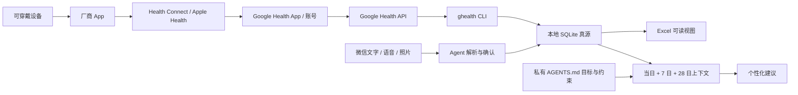

# Open Health Agent

一个本地优先、可审计、可移植到多种 Agent 宿主的个人运动健康 Skill。它把可穿戴、微信文字/语音/照片和手动测量整理成统一健康档案，并要求 Agent **每次给营养、运动或生活建议前，先读取当天数据、趋势、目标和安全约束**。

> 这是个人 wellness/fitness 记录与辅助决策项目，不是医疗器械、诊断、处方或急救服务。

## 它解决什么

- 在电脑端维护私有健康档案：SQLite 是幂等写入与审计真源，Excel 是用户持有的可读导出视图。受管健康 sheet 会在每次导出时从 SQLite 重建；纠错走 CLI，直接编辑只放在自建 sheet。
- 可选通过 `ghealth` 抓取 Google Health API 数据，按小时重叠回看、去重更新，而不是每次追加重复行。
- 支持微信文字；语音需可用转写/STT；食物或仪表照片需有视觉能力的模型。
- 只有“实际吃了/喝了”才记饮食；购买、菜单、计划、菜谱不算摄入。
- 饮食记录包含份量区间、宏量营养素、可验证的微量营养素、来源、覆盖率和不确定性。
- 用用户确认的瘦体重估算静息能量，结合活动热量和食物热效应（TEF），并防止重复计算。
- 用户目标按原话写入私有 `AGENTS.md`/目标历史；无目标时以改善健康为临时目标，参考 WHO 年龄/生命周期建议。
- 目标与健康风险冲突时明确提示，并提供更安全的实现路径。

## 首次对话会先说明什么

任何宿主第一次调用这个 Skill 时，都必须先用用户的语言简要说明：

1. 档案存在哪里、SQLite 与 Excel 各自做什么；
2. 可穿戴数据经过哪些中间环节，为什么“支持设备”不等于“每个指标都有”；
3. 文字、语音、照片分别需要什么能力，以及估算的不确定性；
4. 设备厂商、Apple Health/Health Connect 及其平台账号/应用层、微信/腾讯、Google、模型服务商、STT/视觉服务和 iCloud 可能处理哪些数据；
5. 建议前会读本地最新上下文；
6. 项目的非医疗边界。

如果用户已经明确要求安装、同步或录入，说明后继续；否则先征得确认。

## 数据链路



`ghealth` 指 [Google-Health-API organization 的 google-health-cli 项目](https://github.com/Google-Health-API/google-health-cli)。它查询云端 [Google Health API](https://developers.google.com/health)，**不是直接读取 Health Connect**。设备必须先通过厂商 App 与 Health Connect/Apple Health、Google Health 完成数据同步；Google 官方的[设备连接说明](https://support.google.com/googlehealth/answer/14236613?hl=en-GB)也列出了按设备和指标的差异。

Google 授权有两条不可混用的路径：Desktop OAuth client 配合 `ghealth` 的本机交互式 loopback 登录；或按 Google 当前指南创建 Web Server client、登记 `https://www.google.com`，再用 `ghealth auth login --non-interactive` 和输出的 `--complete` 命令复制 code。OAuth consent screen 仍为 Testing 时，refresh token 可能约 7 天后过期。完整命令见[安装与上手](skills/open-health-agent/references/installation.md)。

初始化后还要让 ghealth 当前活动 profile 使用同一个显式 IANA 时区，例如 `ghealth config set timezone Asia/Shanghai`。`doctor` 只读验证，真实同步会阻止时区不一致；定时任务会固定安装时的 profile 并强制 JSON 输出，不会替用户改 profile。

## 快速开始

安装器不会替你创建模型、微信或 Google 凭据，也不会隐式安装 Hermes。若以 Hermes 为宿主，先按其[官方安装文档](https://hermes-agent.nousresearch.com/docs/getting-started/installation)完成一次普通对话，再安装本项目：

```bash
git clone https://github.com/w2478328197-arch/open-health-agent.git
cd open-health-agent
./install.sh --help
./install.sh
```

首次安装 Hermes，并把**仅 Excel 视图**放进 iCloud Drive 的示例：

```bash
./install.sh \
  --agent hermes \
  --timezone Asia/Shanghai \
  --workbook "$HOME/Library/Mobile Documents/com~apple~CloudDocs/Open Health Agent/健康档案.xlsx"
```

SQLite、目标和凭据仍保留在本地私有目录；放入 iCloud 的工作簿会受 Apple 的同步与留存条款约束。

iPhone 或 Android 手机在这条架构里是设备数据、Google Health 与微信消息的入口，也可查看已经同步的工作簿；本仓库的 SQLite 真源和小时 scheduler 仍运行在受支持的 macOS/Linux 电脑上。

安装后先检查，再进行真实授权或定时同步。安装器会建立稳定的 `open-health-agent` 命令，并在最后打印带私有目录的 `Command:` 前缀；在其后追加 `doctor`、`sync`、`context` 等子命令。默认私有目录可直接运行：

```bash
open-health-agent doctor
```

`doctor` 会校验 SQLite、profile JSON、私有 `AGENTS.md` 目标投影和 Excel 受管表头。未安装 `ghealth` 不会让纯手工记录模式整体报错；其检查会明确标成可选。若三份目标投影因中途断电等原因不一致，运行 `open-health-agent goal repair`，从本地 SQLite 真源重建 profile 与 `AGENTS.md` 后再复查。

微信文字、语音转写和图片识别后的结果都通过同一个本地写入器进入 SQLite，再安全导出 Excel。血压必须同时写收缩压/舒张压，食物必须有 JSON `consumed: true` 才会计入已摄入，照片估算需保留份量范围和置信度。可直接复制的血压、食物宏量/微量、训练、目标和瘦体重示例见[手工录入规范](skills/open-health-agent/references/ledger-schema.md#copyable-manual-entry-examples)。

每个新会话里，Agent 完成首次说明后可运行 `open-health-agent onboarding mark-explained` 留下本地安装审计；用户对连接外部账号或安装后台任务明确同意后，再运行 `open-health-agent onboarding grant-consent`。这两个时间戳不能替代“每个会话先说明”，也不能当作当前用户已经同意新的数据范围。

若 `~/.local/bin` 不在 `PATH`，使用安装器打印的完整命令。指定 `--bin-dir` 或 `--home` 时也以实际打印结果为准；不要随意换成缺少依赖的系统 Python。

自定义 `--home` 不会被写死到全局 wrapper。要让 Hermes 或其他宿主在重启后的新会话继续使用同一份私有档案，请在该宿主的持久环境里设置 `OPEN_HEALTH_AGENT_HOME`，或始终使用安装器打印的完整 `open-health-agent --home /你的私有目录 ...` 前缀。不要把这个私有路径写进公开 Skill 或仓库。

也可以把标准 Skill 安装到支持 Agent Skills 的宿主：

```bash
npx --yes skills add w2478328197-arch/open-health-agent --agent '*'
```

这个方式只保证安装 Skill 说明；本地账本运行时、Excel 模板和定时任务仍需运行仓库安装器。完整步骤见[安装与上手](skills/open-health-agent/references/installation.md)。

## Hermes + 微信

Hermes 是本项目的参考宿主：

```bash
hermes doctor
hermes model
hermes gateway setup
hermes gateway install
hermes gateway start
hermes gateway status
```

- 在 `hermes model` 里选择 **OpenAI Codex**，才是使用 ChatGPT OAuth 登录的路径；直接 OpenAI API key 是另一种 provider/计费路径。参见 [Hermes Provider 文档](https://hermes-agent.nousresearch.com/docs/integrations/providers)。
- 微信接入使用腾讯 **iLink Bot API**，登录后是独立的 `@im.bot` 身份，不是把普通个人微信变成可脚本控制账号；普通群消息常常不可用。当前默认入站 DM 策略是 `open`；发送任何健康数据前，先改为 pairing/仅本人 allowlist、禁用群聊并用非敏感消息验证。仍为 `open` 时不要发送健康信息，并按安装版本复核。参见 [Hermes Weixin 文档](https://hermes-agent.nousresearch.com/docs/user-guide/messaging/weixin)。
- 微信能接收图片和语音，不代表当前模型自动具备看图和转写能力。无视觉/STT 时必须请用户补充文字，不能猜。
- Hermes 当前版本可能把媒体缓存在 `~/.hermes/cache/images`、`audio`、`videos`、`documents`。清理策略随版本和媒体类型变化，尤其不能假定音频/视频会自动删除；限制本机目录权限，按当前版本核查并定期清理不再需要的缓存。

完整配置见 [docs/hermes.md](docs/hermes.md)。

## 热量模型

只有用户确认瘦体重时，才使用 Cunningham 1991 FFM 公式：

```text
估算 REE = 370 + 21.6 × 瘦体重(kg)
```

当活动字段明确是 `active_only`：

```text
计划摄入 = (估算 REE + 完整日平均活动热量 + 目标调整) / (1 - TEF 比例)
```

蛋白质、碳水、脂肪的 TEF 分别用约 20–30%、5–10%、0–3% 的区间估算。若设备给的是已经包含静息消耗的总能量，或使用 PAL，不再叠加 REE/运动/TEF。不会把手表或单次训练热量 1:1 “吃回来”。计算依据与边界见[健康规则](skills/open-health-agent/references/health-rules.md)。

## 目标与规则优先级

私有数据目录中的 `AGENTS.md` 是这个项目的最高持久化用户规范：保存目标原话、优先级和安全约束。它仍然低于系统/开发者指令、紧急安全与法律边界。用户在当前对话确认的新目标，应先写入本地目标历史，再用于计划。

建议顺序是：紧急安全 → 已确认目标 → 当天截至目前 → 完整日 7 天基线 → 28 天趋势 → WHO 冷启动基线 → 偏好与便利。

## 已知边界

- 设备兼容不等于 HRV、睡眠阶段、血氧、VO₂ max 等全部可用。
- 每小时查询不等于每小时出现新数据；手机、厂商 App 和云端都有延迟。
- 食物照片无法可靠识别隐藏用油、完整配方、精确重量和全部微量营养素。
- 可穿戴能量、睡眠阶段和 HRV 都有测量误差；本项目优先趋势，不用单点做诊断。
- `实际睡眠时长_h` 表示 asleep，排除清醒分钟；不能把在床总时长直接当作实际睡眠。
- WorkBuddy、Antigravity 等宿主可以复用 Skill 规范，但文件、命令、视觉、语音和持久定时能力必须逐项验证，不能仅凭宿主名称承诺可用。
- “保留自建 sheet”保证的是常规单元格、公式和基础表结构；openpyxl 对部分宏、嵌入对象、切片器或厂商扩展并不保真。只使用 `.xlsx`，复杂对象另存原文件，并依靠本地受限备份恢复。
- macOS 睡眠时整点任务不会持续运行。插电场景可在“系统设置 → 电池 → 选项”开启“显示器关闭时防止在电源适配器供电时自动进入睡眠”；合盖通常仍会睡眠。参见 [Apple 支持](https://support.apple.com/en-ca/guide/mac-help/-mchlfc3b7879/mac)。
- 后台任务可用 `open-health-agent scheduler install|status|uninstall` 完整管理；Linux 退出登录后能否继续取决于 systemd user linger。macOS 的 AC-only 适配同样提供 `keep-awake-on-ac install|status|uninstall`。

## 项目文档

- [Hermes、模型与微信配置](docs/hermes.md)
- [架构与写入一致性](docs/architecture.md)
- [宿主、平台与数据源兼容性](docs/compatibility.md)
- [隐私说明](PRIVACY.md)
- [安全策略](SECURITY.md)
- Skill 引用：[安装](skills/open-health-agent/references/installation.md) · [数据源](skills/open-health-agent/references/data-sources.md) · [账本结构](skills/open-health-agent/references/ledger-schema.md) · [健康规则](skills/open-health-agent/references/health-rules.md) · [隐私与安全](skills/open-health-agent/references/privacy-safety.md) · [宿主适配](skills/open-health-agent/references/host-adapters.md)

## 隐私与开源贡献

真实健康数据、目标、图片、语音、日志、数据库、Excel、OAuth 文件和 API key 都被排除在 Git 之外。提交 Issue 或测试时只用合成数据。发现安全问题请按 [SECURITY.md](SECURITY.md) 私下报告，不要把密钥或健康信息贴到公开 Issue。

项目采用 [Apache License 2.0](LICENSE)。

## English summary

Open Health Agent is a local-first, auditable personal wellness and fitness Skill. It combines optional Google Health API imports with manual text, voice-transcript, and vision-assisted food/measurement logging; stores an idempotent SQLite ledger; exports a readable Excel view; persists exact user goals locally; and requires fresh health context before personalized advice. The reasoning contract is portable across Agent Skills hosts, while local files, commands, vision, speech, and durable scheduling must be verified per host. It is not a medical device or emergency service.
