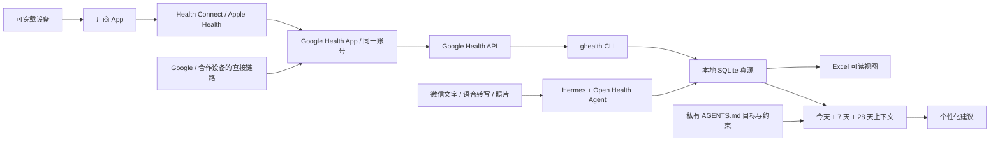

# Open Health Agent

[](skills/open-health-agent/scripts/oha/constants.py)
[](https://www.python.org/downloads/)
[](LICENSE)
[](https://github.com/w2478328197-arch/open-health-agent/actions/workflows/ci.yml)

[English](README_EN.md) · [简体中文](README.md) · [安全政策](SECURITY.zh-CN.md) · [隐私说明](PRIVACY.zh-CN.md)

把 Hermes、微信、Google Health、可穿戴设备和 Excel 串成一个本地优先的个人运动健康 Agent。

你可以在微信里发一句话、语音转写或餐食照片；Agent 会把用户明确确认或符合专用健康对话约定的事件写入本地档案。可穿戴数据可按小时同步。每次给营养、训练、恢复或生活建议前，Agent 必须先读取最新健康上下文和你的目标，而不是只凭聊天记忆回答。

> 这是个人 wellness/fitness 记录与辅助决策项目，不是医疗器械、诊断、处方或急救服务。遇到胸痛、严重呼吸困难、晕厥、新发神经系统症状等紧急情况，先联系当地急救服务，不能先等 Agent 同步或记账。

## 你最终会得到什么

- 微信中的健康入口：文字、可靠的语音转写、视觉模型可读的食物或仪表照片。
- 一份电脑上的私有健康档案：SQLite 负责可靠写入和审计，Excel 负责给人查看。
- 可选的 Google Health 导入：步数、睡眠、训练、活动热量等数据每小时重叠回看并去重更新。
- 持久目标：用户目标按原话保存在私有 `AGENTS.md` 和目标历史中。
- 有数据依据的建议：先读取今天截至目前、完整日 7 天基线、28 天趋势、训练、饮食、目标和数据新鲜度，再给建议。

日常使用不需要手写 JSON。下面这些都是给微信里的 Agent 说的话：

| 你发给 Agent | Agent 应该做什么 |
|---|---|
| `我的目标是提高力量，但我有高血压` | 先保存目标原话和安全约束，再读取健康上下文并给更安全的力量提升路径 |
| `早上血压 128/82` | 记录收缩压、舒张压、时间、来源和原话，返回记录结果 |
| `今天抗阻训练 45 分钟，RPE 8` | 写入训练记录，重建当天上下文，再调整饮食和恢复建议 |
| `午饭吃了这个` + 餐食照片 | 视觉可用时估算食物、份量区间、宏量营养和可验证的微量营养；保留置信度和不确定性 |
| `今天怎么吃、还要不要运动？` | 先运行健康上下文，再按今天是抗阻、有氧、休息或恢复不足日给建议 |

## 数据是怎么走的

第三方设备的**典型**链路如下；Fitbit、Pixel 和部分合作设备可能通过 Google 自有或直接合作链路进入 Google Health，不一定经过每一个中间层。



这里使用的 [`ghealth`](https://github.com/Google-Health-API/google-health-cli) 是一个独立开源 CLI，用来查询云端 [Google Health API](https://developers.google.com/health)；它不是直接读取 Health Connect、Apple Health、Garmin Connect 或手表。本项目与 Google、Hermes、腾讯和任何设备厂商都没有隶属或背书关系。

## 真实支持范围

本项目**不维护硬件白名单**。“支持某品牌”不等于“该品牌的全部型号、地区和指标都能导入”。一个指标只有同时满足以下条件才可用：

1. 设备把该指标同步到厂商 App；
2. 厂商链路把它写入 Google Health 接受的数据源；
3. 同一个 Google Health 账号里能看到该指标；
4. 用户授权了对应只读 scope；
5. Google Health API 实际返回它；
6. Open Health Agent 当前适配器已经映射该类型。

[`ghealth`](https://github.com/Google-Health-API/google-health-cli) 当前声明 40 类经过真实 API 验证的数据类型，覆盖活动、连续/每日生命体征、身体测量、睡眠、训练、血糖、ECG、体温、饮水和营养等；可用 `ghealth schema types` 查看安装版本的完整清单。**这不等于本项目已经自动导入全部 40 类。** Open Health Agent 当前只映射以下 14 类查询：

`steps`、`distance`、`active-energy-burned`、`active-minutes`、`daily-resting-heart-rate`、`daily-heart-rate-variability`、`daily-oxygen-saturation`、`daily-respiratory-rate`、`daily-vo2-max`、`weight`、`body-fat`、`height`、`sleep --detail`、`exercise`。

因此，全天连续心率、楼层、海拔、心率区间、久坐、游泳、基础/总热量、血糖、体温、睡眠温度、ECG、不规则心律通知以及 Google Health 中的饮水/营养日志等，即使 `ghealth` 能查询，当前也不会由 OHA 自动写入。训练记录中可能带平均/最高心率，但这不等于已导入全天心率。缺失日期和空结果必须保留为空，不能当成 0。

### Google Health 官方列出的设备路径

下表是 Google 截至 **2026-07-14** 公布的代表性链路与明确缺口，不是本项目对硬件的认证。最终仍要在同一账号的 Google Health 中看到目标指标，再逐项用 `ghealth`/OHA 验收。型号、系统版本、地区、订阅和权限都可能改变结果。

| 设备/来源 | 到 Google Health 的路径 | Google 列出的代表性数据 | Google 明确列出的缺口或条件 |
|---|---|---|---|
| Fitbit / Pixel Watch | Google 第一方设备路径 | 步数、距离、睡眠、训练、静息心率；部分型号/地区还有 HRV、SpO₂、呼吸率 | 数据取决于设备型号、地区和资格；OHA 当前不映射全天心率、皮温、ECG 或不规则心律 |
| Apple Watch | Apple Watch → Apple Health → Google Health | 步数、楼层、距离、总能量、睡眠、训练/路线、体重/身体测量、VO₂ max、心率和夜间生命体征 | 暂无运动分钟、站立小时、ECG/不规则心律提醒和全天生命体征 |
| Garmin | Garmin → Garmin Connect → Health Connect / Apple Health → Google Health | 步数、距离、楼层、能量、睡眠、训练摘要、心率/静息心率、体重 | 不共享 HRV、呼吸率、SpO₂、VO₂ max、皮温、分钟/小时能量、路线和分圈 |
| Mi Fitness / Xiaomi | Xiaomi → Mi Fitness → Health Connect → Google Health；仅 Android | 运动中心率、步数、距离、能量、睡眠、训练摘要/地图、体重 | 不共享 HRV、呼吸率、SpO₂、VO₂ max、皮温、运动外心率和分钟/小时距离/能量 |
| Samsung Galaxy Watch | Galaxy Watch → Samsung Health → Health Connect → Google Health；仅 Android | 步数、距离、能量、睡眠、训练、心率、SpO₂、VO₂ max、体重 | 不共享静息心率、HRV、呼吸率、皮温、路线/分圈；需在 Samsung Health 同意处理健康与健身数据 |
| Oura Ring | Oura → Oura App → Health Connect / Apple Health → Google Health | 步数、距离、睡眠、训练摘要、心率、HRV、体重 | 不共享静息心率、呼吸率、SpO₂、VO₂ max、皮温、路线/分圈；OHA 也不查询普通全天心率流 |
| Whoop | Whoop → Whoop App → Health Connect → Google Health；仅 Android | 运动中心率、步数、热量、距离、睡眠、训练、静息心率、呼吸率、SpO₂、体重 | 不共享 HRV、VO₂ max、皮温、运动外心率、路线和分圈 |
| Withings | Withings → Withings App → Health Connect / Apple Health → Google Health | 当前 Google 设备页未给完整指标矩阵，必须逐项验证 | Google 明确说明 Withings 血压数据尚不支持；请通过微信或 CLI 手工记录 |
| Zepp / Amazfit | Amazfit → Zepp → Health Connect / Apple Health → Google Health | 步数、距离、能量、睡眠、训练、心率/静息心率、体重、呼吸率、VO₂ max、SpO₂、路线 | 不共享 HRV、皮温、楼层、分圈和心律提醒 |

来源：[Google 第三方设备兼容说明](https://support.google.com/googlehealth/answer/14236613?hl=en) · [Google Health API 支持设备](https://developers.google.com/health/about?hl=en) · [`ghealth` 锁定上游版本](https://github.com/Google-Health-API/google-health-cli/tree/6dad482c528b91d6562eadc829fd3e717df5b75a)

### 图片、语音和模型能力

微信能收到图片，只证明消息通道成功；Hermes 还要把真实像素交给模型，模型或辅助视觉服务也必须能理解图片。三层中任何一层失败，都不能声称“看过照片”。

| Hermes 中选择的 provider / 模型路径 | 直接图片输入 | 微信照片能否用于记录 | 重要边界 |
|---|---|---|---|
| OpenAI Codex（ChatGPT OAuth） | 当前官方标为 vision 的 Codex 模型支持 | 通常可以，仍需用微信实测 | 安装 Codex CLI 不是前提；ChatGPT OAuth 不是 OpenAI API key |
| OpenAI API | 选择支持 image input 的 GPT-5.x、GPT-4.1/4o 等模型时支持 | 可以 | 必须核对实际 model ID；文本/音频专用模型不能自动看图 |
| Anthropic Claude | 当前 Claude vision 模型支持 | 可以 | 需由 Hermes 走正确的原生图像格式 |
| Google Gemini | Google 当前文档将 Gemini 模型列为多模态 | 可以 | 仍受具体 endpoint、model ID 和 Hermes 版本影响 |
| Nous Portal、OpenRouter、Copilot、Bedrock | 取决于所选模型，不取决于聚合器名称 | 视模型而定 | 同一 provider 内既可能有视觉模型，也可能有纯文本模型 |
| DeepSeek 官方 API | **当前不支持直接图片输入**；用户消息 schema 是文本 | 主模型不能直接看图；可选 Hermes 辅助视觉旁路 | Hermes 可先让另一视觉模型描述图片，再把文字交给 DeepSeek；此时照片会经过第二个模型提供商 |
| Ollama / vLLM / LM Studio / 自定义 endpoint | 取决于模型和服务是否实现图片协议 | 需逐端点实测 | `Qwen-VL`、`MiMo-VL` 等视觉模型与普通文本/编码模型不能混为一谈 |

截至 2026-07-14，DeepSeek 官方 V4 直连 API 仍是纯文本；兼容别名 `deepseek-chat` 和 `deepseek-reasoner` 计划于 **2026-07-24 15:59 UTC** 停用，新配置应使用 `deepseek-v4-flash` 或 `deepseek-v4-pro`。更换名称不会获得图片输入能力。

官方依据：[OpenAI 图片与视觉](https://developers.openai.com/api/docs/guides/images-vision) · [Claude vision](https://platform.claude.com/docs/en/build-with-claude/vision) · [Gemini 图片理解](https://ai.google.dev/gemini-api/docs/image-understanding) · [DeepSeek Chat API schema](https://api-docs.deepseek.com/api/create-chat-completion/) · [Hermes Vision 路由](https://hermes-agent.nousresearch.com/docs/user-guide/features/vision) · [Hermes providers](https://hermes-agent.nousresearch.com/docs/integrations/providers)

语音是另一条能力链：微信/Weixin 能传递语音文件，并不表示任何上述文本或视觉模型会自动完成可靠转写。只有入站消息已有可信 transcript，或另行配置并测试了 STT，才能把语音写入档案；否则请用户补文字。本机核实的 Hermes v0.18.0 中，无转写的 Weixin 语音会保存为 SILK，而内置转写工具接受的格式清单不含 SILK，因此不能直接承诺自动转写；必须先明确转码/自定义 STT，或改用文字。每次更换 Hermes 版本、provider 或 model 后，用一段普通文字、一张无敏感信息的测试图和一句固定测试语音分别验收。

| 其他能力 | 最低要求 | 没有时的行为 |
|---|---|---|
| 微信文字记录 | 文本模型、本地文件和命令权限 | 可正常使用 |
| 小时可穿戴同步 | Google Health、`ghealth`、电脑后台任务 | 仍可使用纯手工记录模式 |
| iCloud Excel | macOS 已开启 iCloud Drive | Excel 保存在本机普通路径 |

开始前先确认：

```bash
git --version
python3 --version
```

本地账本需要 Python 3.10+。只有启用可穿戴导入时才需要 Go 1.23+、Google 账号、Google Health App 和 Google Cloud OAuth client。纯文字手工记录不需要 Google、微信、视觉模型或 iCloud。

缺少依赖时：macOS 可先运行 `xcode-select --install` 安装 Git/Command Line Tools，并从 [Python 官方下载页](https://www.python.org/downloads/)安装 Python 3.10+；完整可穿戴模式再从 [Go 官方下载页](https://go.dev/dl/)安装 Go 1.23+。使用 Homebrew 的用户也可以通过 Homebrew 安装 Git、Python 和 Go。Linux 请使用发行版包管理器，并确认实际版本满足要求。系统不必安装 Microsoft Excel 才能生成 `.xlsx`，但查看工作簿需要 Excel、Numbers、LibreOffice 或其他兼容应用。

本文使用 `Asia/Shanghai` 作为示例。中国标准时间以外的用户必须把 OHA 初始化、`ghealth config` 和其他示例里的时区全部替换成自己的 [IANA 时区名称](https://en.wikipedia.org/wiki/List_of_tz_database_time_zones)，例如 `Europe/Berlin` 或 `America/New_York`；不要使用含义不唯一的 `CST` 等缩写。

## 从零安装：Hermes + 微信 + Google Health

以下是参考主线：macOS 或 Linux 电脑运行 Hermes、账本和后台任务，iPhone/Android 负责设备同步、Google Health 和微信。Windows 原生环境的核心账本原则上可运行，但本仓库尚未承诺完整的 Windows 后台调度体验。

### 1. 安装并验证 Hermes

macOS 推荐使用 [Hermes Desktop 安装器](https://hermes-agent.nousresearch.com/docs/getting-started/installation)；Hermes 官方说明该安装器同时安装 Desktop 和 CLI。安装完成后关闭并重新打开终端，验证：

```bash
command -v hermes
hermes version
hermes doctor
```

macOS、Linux 或 WSL2 也可使用官方 CLI 安装命令：

```bash
curl -fsSL https://hermes-agent.nousresearch.com/install.sh | bash
command -v hermes
hermes doctor
```

不希望直接执行远程脚本时，使用 Desktop 安装器，或先下载并审阅 Hermes 官方脚本再运行。

配置模型或登录方式：

```bash
hermes model
hermes
```

- 要使用 ChatGPT OAuth，在 `hermes model` 中选择 **OpenAI Codex**。这不是 OpenAI API key，也不等于 API 计费账户。
- 要使用 OpenAI API、DeepSeek、Gemini 或其他 provider，也在 `hermes model` 中分别配置。能力和数据处理条款取决于实际 provider/model。
- 照片录入前必须发一张无敏感内容的测试图，确认当前模型真的能看图。若所选 DeepSeek endpoint/model 不接收图片，就只能使用文字，或另外配置视觉模型。
- 运行 `hermes tools`，确认微信所用配置可以使用 Skills、Terminal/Files；需要照片时再确认 Vision。若选择了 Blank Slate 之类的最小工具配置，Hermes 可能能聊天却不能写本地档案。

官方参考：[Hermes 安装](https://hermes-agent.nousresearch.com/docs/getting-started/installation) · [Provider 配置](https://hermes-agent.nousresearch.com/docs/integrations/providers) · [CLI 命令](https://hermes-agent.nousresearch.com/docs/reference/cli-commands)

### 2. 安全接入微信

Hermes 的个人微信适配器使用腾讯 iLink Bot API。扫码后得到的是独立的 `...@im.bot` 身份，不是把普通个人微信变成可脚本控制账号；直接消息通常比普通群可靠。

```bash
hermes gateway setup
```

在向导中选择 Weixin，扫码并记下成功信息里的 `account_id`。先编辑 `~/.hermes/.env`，至少设置：

```dotenv
WEIXIN_ACCOUNT_ID=扫码后得到的-account-id
WEIXIN_DM_POLICY=pairing
WEIXIN_GROUP_POLICY=disabled
```

然后在前台启动，并从自己的微信只发送一条不敏感的测试消息：

```bash
hermes gateway run
```

从 gateway 日志或入站事件中取得你自己的 Weixin user ID 后，停止前台服务，把策略收紧为：

```dotenv
WEIXIN_DM_POLICY=allowlist
WEIXIN_ALLOWED_USERS=你自己的-Weixin-user-ID
WEIXIN_GROUP_POLICY=disabled
```

最后安装并检查后台 gateway：

```bash
hermes gateway install
hermes gateway start
hermes gateway status
```

当前 Hermes 的 Weixin 私信默认策略是 `open`；健康场景不要保留默认值。`WEIXIN_ALLOWED_USERS` 是入站过滤器，不是邀请系统。完整说明见 [Hermes Weixin 文档](https://hermes-agent.nousresearch.com/docs/user-guide/messaging/weixin)。若向导报告缺少 `aiohttp` 或 `cryptography`，按该官方页面安装 messaging 依赖后再继续。

Weixin/iLink Bot 的可用性取决于当前 Hermes 版本、腾讯账号和地区。如果向导没有 Weixin、扫码失败或 iLink 不向该账号开放，不要绕过访问控制；先使用 Hermes CLI 或纯手工账本模式，并按当前官方文档排查。

微信可以接收图片和语音，不代表模型必然能理解它们。无转写的语音可能只是本地缓存的 SILK 文件；无视觉能力的模型也不能识别图片。

### 3. 安装 Open Health Agent：先选宿主，再选一次工作簿位置

**要在微信里交流，必须安装到 Hermes。** 原因不是 Hermes 的模型一定更强，而是本架构中真正接收 Weixin/iLink 消息的是 Hermes gateway。把 Skill 只装进 Codex，不会让 Codex 自动接管微信。

| 你的用法 | Skill 安装位置 | 结论 |
|---|---|---|
| 只从微信使用 | Hermes | 必选；使用 `--agent hermes` |
| 微信使用，同时希望 Codex 也能维护/读取同一档案 | Hermes + Codex | 推荐给同时使用两者的人；一次命令重复传入两个 `--agent` |
| 只在 Codex App/CLI 本地使用，不需要微信 | Codex | 使用 `--agent codex`；不会获得微信入口 |
| WorkBuddy / Antigravity 等 | 实际接收消息并能执行本地命令的那个宿主 | 按其当前 Skill 机制安装并逐项实测 |

Hermes 和 Codex 的 Skill 副本都调用同一个本机 `open-health-agent` 命令和同一私有数据目录；不要为两个宿主建立两份会互相分叉的账本。Codex 安装后通常要开启一个新任务才能发现新 Skill；Hermes gateway 在安装后要重启。

先克隆仓库：

```bash
git clone https://github.com/w2478328197-arch/open-health-agent.git
cd open-health-agent
```

选项 A：Excel 使用默认本地路径。只在微信使用时运行：

```bash
./install.sh --agent hermes --timezone Asia/Shanghai
```

如果还要让 Codex 使用同一个 Skill，**改为只运行下面这一条**，不要先运行上一条：

```bash
./install.sh --agent hermes --agent codex --timezone Asia/Shanghai
```

选项 B：仅把 Excel 视图放进 iCloud Drive：

```bash
./install.sh \
  --agent hermes \
  --timezone Asia/Shanghai \
  --workbook "$HOME/Library/Mobile Documents/com~apple~CloudDocs/Open Health Agent/健康档案.xlsx"
```

选项 B 同样可以在 `--agent hermes` 后增加 `--agent codex`。不要先运行 A 再运行 B。安装器会保护已有私有配置，第二次普通安装不会覆盖工作簿路径或时区。选项 B 仅适用于 macOS，并且必须先在系统设置中开启 iCloud Drive。

安装器默认把命令放在 `~/.local/bin`。当前终端找不到 `open-health-agent` 时运行：

```bash
export PATH="$HOME/.local/bin:$PATH"
```

这只影响当前终端。需要长期使用时，把同一行加入 `~/.zshrc` 或 `~/.bashrc`；也可以始终使用安装器最后打印的完整 `Command:` 前缀。后台 Hermes gateway 是否能执行该命令，必须以后面的微信实测为准，不能用当前终端成功来代替。

如果 Hermes gateway 已经在后台运行，安装新 Skill 后重启一次：

```bash
hermes gateway restart
```

如果已经安装过，现在才想改时区、改成 iCloud 或选择一份已有 `.xlsx`，使用：

```bash
open-health-agent init --force \
  --timezone Asia/Shanghai \
  --workbook "$HOME/Library/Mobile Documents/com~apple~CloudDocs/Open Health Agent/健康档案.xlsx"
```

`init --force` 会备份并更新明确给出的配置字段，不会删除现有 SQLite、目标或私有档案。若新路径指向空文件，旧工作簿里的自建 sheet 不会自动搬过去；若指向一份已有 `.xlsx`，普通自建 sheet 会尽量保留。已有复杂 Excel 请先另做备份：受管健康 sheet 会从 SQLite 重建，宏、嵌入对象、切片器或厂商扩展不保证完整保真。

现在验证本地账本和 Skill：

```bash
open-health-agent doctor
hermes chat -q "/open-health-agent 请先解释这个 Skill，然后检查我的健康档案是否可用"
```

合格的第一条回复会先解释本地存储、数据链路、照片/语音条件、第三方处理范围、不确定性和非医疗边界，然后继续执行你已经明确要求的检查。若第一条消息是紧急情况，则先给紧急处置方向，不能先跑说明、同步或记账。

确认这次说明确实已经完成后，检查并记录本地审计时间戳：

```bash
open-health-agent onboarding status
open-health-agent onboarding mark-explained
```

这个时间戳只用于本机安装审计，不能让 Agent 在未来新会话里跳过首次说明。

### 4. 在手机端连接 Google Health

纯手工模式可以跳过本节和后面的 `ghealth`、scheduler。

1. 在 iPhone 或 Android 安装并登录 Google Health App；它是手机 App，不是手表 App。
2. 让设备先同步到厂商 App，例如 Mi Fitness、Garmin Connect、Samsung Health、Oura 或其他厂商 App。
3. 按设备支持情况，通过 Android Health Connect、iPhone Apple Health，或 Google 支持的直接合作路径连接到同一个 Google Health 账号。
4. 打开厂商 App 完成一次同步，再打开 Google Health，确认你真正需要的每个指标已经出现。
5. 如果 HRV、睡眠或训练缺失，先在这一层查权限、地区、系统版本和品牌指标支持；小时任务无法抓取从未进入 Google Health 的数据。

### 5. 安装并授权 ghealth

本仓库的构建脚本需要 Git 和 Go 1.23+，会从锁定的上游源码版本构建 `ghealth`：

```bash
go version
./scripts/install_ghealth.sh --dry-run
./scripts/install_ghealth.sh
export PATH="$HOME/.local/bin:$PATH"
ghealth setup --instructions
```

按照 `ghealth` 自己输出的步骤，在 Google Cloud 中启用 Google Health API，并创建 OAuth client ID。这里必须选择 **Desktop application**，下载 client secret JSON 后运行：

```bash
ghealth setup --scopes-preset readonly
ghealth auth status --validate
ghealth config set timezone Asia/Shanghai
```

`ghealth setup` 会使用本机 loopback + PKCE 完成浏览器授权。Google 的通用 API 设置页还介绍了 **Web Server** client 和 `https://www.google.com` redirect URI；那是直接编写 API 客户端的流程，不能拿来替代这个 CLI 所需的 Desktop client。

若 OAuth consent screen 处于 Testing，要把实际同步 Google Health 的同一账号加入 test users。账号、地区或项目若无法启用 Google Health API，完整可穿戴模式就不能继续；这时仍可使用微信/CLI 手工记录模式。

无图形浏览器的电脑仍然使用同一个 Desktop client：

```bash
ghealth auth login --non-interactive --scopes-preset readonly
# 在自己的浏览器打开 auth_url，从回跳地址栏只复制 code 查询参数：
ghealth auth login --complete '<code>'
ghealth auth status --validate
```

`ghealth` 会把 client 和明文 token 保存在 `~/.config/ghealth/`，上游会将文件权限设为仅当前用户可读写。完成并验证后可删除 Downloads 中多余的 client JSON 副本，但不要删除 `ghealth` 管理的配置目录。不要把 client secret、授权 URL、code、token 或完整配置输出发到聊天、Issue 或 Git。Google consent screen 若仍处于 Testing，refresh token 可能较快过期；这和“账号里没有健康数据”是两种不同问题。失效时重新运行 `ghealth auth login --scopes-preset readonly`，再执行 `auth status --validate`、手动 `sync` 和 scheduler 检查。

先做一条最近两天的步数小查询；`--to` 在当前锁定版本中包含指定日期：

```bash
ghealth data steps daily-rollup --from yesterday --to today
```

空结果可能表示这两天确实无数据，也可能是设备、账号、scope 或同步链路未打通。步数通过只证明步数；睡眠、训练、HRV 等每个目标指标都要在 Google Health 中可见，并通过对应 `ghealth` 查询或后续 OHA `sync`/`context` 逐项验收。

### 6. 第一次同步并检查 Excel

OHA 和 `ghealth` 的时区必须使用完全相同的 IANA 名称。然后依次运行：

```bash
open-health-agent doctor
open-health-agent sync
open-health-agent context
```

检查四件事：

- `doctor` 的本地账本检查通过；未启用 scheduler 时，部分 ghealth 检查仍会标为 optional，所以整体 `ok` 不能单独证明可穿戴链路已打通；
- `ghealth auth status --validate` 和当天步数小查询真实通过；
- 检查 `sync` JSON 内的 `status`、`errors` 和计数。逐指标查询部分失败时命令仍可能正常退出，只有 `status=success` 才是完整成功；`partial`、`failed`、`empty` 必须按原因处理，不能把缺失写成 0；
- Excel 出现 `健康日报`、`训练记录`、`健康测量`、`饮食记录`、`每日营养汇总`、`目标历史` 和 `同步日志` 等受管 sheet。

`open-health-agent context` 才是 Agent 每次建议前读取健康表格的标准接口。它读取与 Excel 同源的 SQLite 真源，不是让模型每次直接猜测或自由编辑 `.xlsx`。

### 7. 启用每小时同步和插电待机

只有手动 `sync` 成功、用户明确同意后台运行后，才安装小时任务：

```bash
open-health-agent onboarding grant-consent
open-health-agent scheduler install --interval-seconds 3600
open-health-agent scheduler status
```

安装时 scheduler 会解析并保存当前 `ghealth` 的绝对路径和活动 profile，不依赖交互式 shell 的临时 `PATH`。刚安装后的 `status` 只证明任务定义和服务状态，不证明它已经自动同步过。保持电脑唤醒，等过下一个约 3600 秒触发点后再次运行 `scheduler status` 和 `open-health-agent context`，并检查 Excel 的 `同步日志` 是否出现新的成功时间戳。

Hermes gateway 和健康 scheduler 是两个不同的后台服务：

- Hermes gateway 接收微信并让 Agent 调用 Skill；
- Open Health Agent scheduler 每小时读取 Google Health、写 SQLite、再安全导出 Excel。

两者都必须以同一受信任的系统用户运行。不要再并行保留旧 cron、旧导入脚本或第二个 Excel 写入器。

这是约每 3600 秒运行一次，不保证在钟表整点触发。断网、睡眠或上游延迟会产生失败、部分成功或延迟；后续任务会用重叠回看窗口补抓晚到数据。macOS 用户级 launchd 任务通常要在用户登录后运行；重启后登录并检查一次 `scheduler status`。

macOS 完全睡眠时不会持续运行小时任务。插电使用可在“系统设置 → 电池 → 选项”开启“显示器关闭时防止在电源适配器供电时自动进入睡眠”，并保持 MacBook 打开。也可以使用本项目可撤销的 AC-only 适配：

```bash
open-health-agent keep-awake-on-ac install
open-health-agent keep-awake-on-ac status
```

它只在接通电源时防止空闲系统睡眠，不能保证合盖后运行。移除命令是：

```bash
open-health-agent keep-awake-on-ac uninstall
open-health-agent scheduler uninstall
```

Linux 使用 systemd user timer；退出登录后是否继续运行取决于 user linger，请以 `scheduler status` 的结果为准。

## 第一次在微信中验收

按下面顺序做一遍，才能算完整可用：

1. 发 `/open-health-agent 我想开始使用健康档案`。Agent 应先讲解 Skill，再继续。
2. 发一个新目标，例如“我的目标是提高力量，但我有高血压”。Agent 应先保存原话和安全约束，再给计划。
3. 发“早上血压 128/82”。Agent 应明确回复是否写入、记录 ID 和保存的数值。
4. 发“今天抗阻训练 45 分钟，RPE 8”。Agent 应写入训练，并根据训练日调整后续建议。
5. 发“午饭吃了这个”并附一张无敏感内容的餐食测试图。Agent 应先简短回显识别到的摄入项目，再记录份量区间、估算来源和置信度。
6. 发一条语音。只有存在可信转写或 STT 时才应记录；否则 Agent 应请你补文字。
7. 问“我今天怎么吃、还需要运动吗？”回复应注明数据截止时间、今天是否完整、同步是否新鲜，并体现当天训练和你的目标。
8. 打开 Excel，确认上述记录存在；再运行一次 `open-health-agent context`，确认机器上下文也包含它们。

如果微信里的 Hermes 报找不到 `open-health-agent`，让它改用安装器打印的完整 `Command:` 前缀（默认可执行文件是 `~/.local/bin/open-health-agent`），然后重启 gateway 再测试。只有微信端实际完成一次写入和 context 读取，才说明后台 Hermes 的命令环境正确。

在专用健康/饮食对话里，本项目采用参考 Hermes 工作流中的简化约定：**单独发送一张近距离餐食照片，且没有购物、菜单、未开封包装、计划或背景物线索时，默认表示“把这次实际摄入记下来”**，无需再问“要不要记录”，也不要求用户称重。Agent 仍须先读图、回显识别到的摄入项目、估算中心值和范围；食物身份真正不清楚时只问一个短问题。购物车、菜单、菜谱、价格标签、未开封食物和背景物不能算作已吃。

如果不想采用这条约定，每次配图写“我吃了这个”即可；也可以在私有 `AGENTS.md` 里明确改成“每张照片先确认”。

## 这个 Skill 强制 Agent 遵守什么

### 每个新会话先讲解

除紧急情况外，任何支持 Agent Skills 的宿主第一次使用本 Skill 时，都要先用用户的语言简要说明：

1. SQLite、Excel 和私有目标文件分别保存什么；
2. 可穿戴数据经过哪些第三方和中间层；
3. 文字、语音、图片分别需要什么能力；
4. 微信/腾讯、设备厂商、Apple/Android 健康层、Google、模型/STT/视觉提供商和所选云盘可能处理哪些数据；
5. 照片营养和可穿戴测量有什么不确定性；
6. 每次建议前会读取最新本地健康上下文；
7. 这不是医疗或急救服务。

用户已经明确要求安装、同步或录入时，说明后直接继续，不要无故停下来重复征求同一件事。紧急情况永远先给紧急处置方向。

### 固定的写入与建议顺序

```text
用户新目标 → 保存原话和安全约束
用户新数据 / ghealth 新数据 → 写入 SQLite → 导出 Excel
需要给建议 → open-health-agent context
               → 检查截止时间、新鲜度、缺失、今天是否完整
               → 按目标与安全约束给建议
```

- 新数据写入后必须重建 context，不能继续使用旧上下文。
- context 读取失败、数据过期或关键字段缺失时，只能给保守、带条件的通用建议，不能声称已经个性化。
- 今天的数据必须标“截至目前”；完整日 7 天基线和 28 天趋势用于比较。
- 抗阻日、有氧日、休息日、恢复不足日和数据不完整日的饮食、活动、补水与恢复建议必须不同。
- 更正同一事件时更新原记录，不能追加一个互相矛盾的副本。

### 目标是最高的项目级用户规范

用户说出、修改、暂停或撤销健康/运动目标时，Agent 先按原话写入私有 `AGENTS.md`、目标历史和 profile，再制定计划。它是本项目最高的持久化用户规范，但仍低于系统规则、紧急安全和医疗边界。

目标与健康风险冲突时，不能悄悄忽略任何一边。例如“高血压但要提高力量”应保留力量目标，同时避免默认推荐极限重量、力竭、屏气用力或未经评估的高强度训练，并给出更安全的进阶路径。没有明确目标时，以提升健康为临时目标，使用适合年龄和生命阶段的 [WHO 身体活动建议](https://www.who.int/news-room/fact-sheets/detail/physical-activity)作为冷启动基线。

## 热量和营养规则

只有用户确认了瘦体重，才使用 Cunningham 1991 FFM 公式估算静息能量：

```text
估算 REE = 370 + 21.6 × 瘦体重(kg)
```

当设备字段明确是 `active_only` 活动热量时：

```text
计划摄入 = (估算 REE + 完整日平均活动热量 + 目标调整) / (1 - TEF 比例)
```

- 蛋白质、碳水、脂肪的 TEF 分别用约 20–30%、5–10%、0–3% 的区间估算。
- 若设备给的是已经含静息消耗的总能量，或使用 PAL，不能再叠加 REE、训练热量或 TEF。
- 不把手表或单次训练热量 1:1“吃回来”；使用范围并说明误差。
- 照片只能估算可见食物和份量。隐藏用油、配方、重量、钠和全部微量营养通常无法完整确认。
- 本地 CLI 负责验证和保存 Agent/可靠来源给出的营养字段，不自带一套权威照片营养数据库。没有可靠来源的微量营养应留空，并报告覆盖率，不能编造为 0。

计算和安全依据见[健康规则](skills/open-health-agent/references/health-rules.md)。

## Excel、SQLite 和自建指标

- SQLite 是唯一写入和审计真源；Excel 是从同一份数据生成的可读视图。
- Agent 的标准“读健康表”动作是 `open-health-agent context`，不是直接扫描任意 Excel 单元格。
- 血压计、血糖仪、握力、腰围等未接入 Google Health 的指标，可以通过微信文字、可信语音转写、仪表照片或 CLI 进入 `健康测量`。
- 要让自建指标影响建议，必须通过 Agent/CLI 作为结构化记录写入。用户自己新增的普通 Excel sheet 会尽量保留，但不会自动进入 context 或建议模型。
- 受管健康 sheet 不能作为第二个写入真源。纠错应让 Agent 更新原记录，再重新导出。
- 如果使用 iCloud，只建议同步 Excel 视图；SQLite、`AGENTS.md`、OAuth token、图片和日志留在本机私有目录。
- 默认私有目录是 `~/.open-health-agent`。安装器在支持的系统上把目录设为仅当前用户访问、文件设为仅当前用户读写，但 SQLite 和配置并不自带静态加密；建议启用 FileVault、LUKS 或等价的整盘加密，并锁好系统账户。
- 第一次同步、迁移或修复时关闭 Excel/Numbers，避免它和 iCloud 同时形成另一个写入者。普通查看可以继续，但不要在受管健康 sheet 上直接改数值；iCloud 冲突副本也不能当作 SQLite 的替代真源。

详细字段和可复制 CLI 例子见[账本规范](skills/open-health-agent/references/ledger-schema.md)。

### 备份和停用

当前版本没有一键加密备份。备份 SQLite 真源前，先停止 Hermes gateway 并运行 `open-health-agent scheduler uninstall`，确认没有写入者，再把整个 `~/.open-health-agent` 复制到受控的加密备份位置；只备份 iCloud Excel 不能恢复完整审计状态。恢复后先运行 `open-health-agent doctor`、`export` 和 `context`，再重新启用服务。

完全停用时先执行：

```bash
open-health-agent scheduler uninstall
open-health-agent keep-awake-on-ac uninstall
hermes gateway stop
hermes gateway uninstall
ghealth auth logout
```

随后在 Google 账号/Cloud 项目中撤销授权，按 Hermes 官方方式解除 Weixin，并在确认备份后自行删除 `~/.open-health-agent`、`~/.config/ghealth`、所选 iCloud 工作簿及不再需要的 Hermes 媒体缓存。不要用删除整个 `~/.hermes` 的方式误伤其他 Hermes 配置。

## WorkBuddy、Antigravity 和其他 Agent 宿主

Skill 的行为规范可移植，但仓库安装器当前内置的 `--agent` 选项只有 Hermes、Codex 和 Claude。WorkBuddy、Antigravity 或其他宿主需要：

1. 用宿主自己的标准 Skills 安装方式，或把 Skill 安装到显式目录：

   ```bash
   ./install.sh --skill-dir '/该宿主的/skills/目录' --timezone Asia/Shanghai
   ```

2. 验证宿主能读取 `SKILL.md`、私有 `AGENTS.md`，并能执行本地 `open-health-agent` 命令。
3. 分别验证图片、语音转写、微信/消息通道和后台持久运行，不能只凭宿主名称假定可用。

也可仅安装标准 Skill 说明：

```bash
npx --yes skills add w2478328197-arch/open-health-agent --agent '*'
```

这条可选命令要求宿主机已有 Node.js/npm。它不会安装本地 Python 账本、Excel 模板、`ghealth` 或 scheduler。需要完整功能时仍要克隆仓库并运行一次安装器。

## 验收清单

- [ ] 新会话第一次使用先讲解；紧急消息先安全处置。
- [ ] Hermes 普通对话、Skills、Terminal/Files 正常。
- [ ] 微信 DM 已改为 pairing/本人 allowlist，群聊 disabled。
- [ ] 图片和语音分别做过真实能力测试。
- [ ] Google Health 手机端能看到目标指标。
- [ ] `ghealth auth status --validate` 通过，OHA 与 ghealth 时区一致。
- [ ] 手动 `open-health-agent sync` 成功后才安装 scheduler。
- [ ] `open-health-agent context` 显示截止时间、新鲜度、目标和数据缺口。
- [ ] 目标、血压、训练和餐食照片都能写入并在 Excel 中看到。
- [ ] 购买/菜单/计划没有误记为已摄入，重复同步不会增加重复行。
- [ ] 真实健康数据、Excel、图片、语音、OAuth 文件和 API key 都没有进入 Git。

## 文档与隐私

- [Hermes、模型与微信配置](docs/hermes.md)
- [完整安装与迁移](skills/open-health-agent/references/installation.md)
- [数据源与 OAuth](skills/open-health-agent/references/data-sources.md)
- [架构与一致性](docs/architecture.md)
- [兼容性](docs/compatibility.md)
- [账本结构](skills/open-health-agent/references/ledger-schema.md)
- [健康规则](skills/open-health-agent/references/health-rules.md)
- [隐私说明](PRIVACY.zh-CN.md)
- [安全策略](SECURITY.zh-CN.md)

真实健康数据、目标、图片、语音、日志、数据库、Excel、OAuth 文件和 API key 都被排除在 Git 之外。提交 Issue 和测试只能使用合成数据。发现安全问题请按[安全政策](SECURITY.zh-CN.md)私下报告。

项目采用 [Apache License 2.0](LICENSE)。

完整英文安装、兼容性和使用说明见 [README_EN.md](README_EN.md)。
