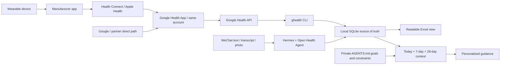

# Open Health Agent

[](skills/open-health-agent/scripts/oha/constants.py)
[](https://www.python.org/downloads/)
[](LICENSE)
[](https://github.com/w2478328197-arch/open-health-agent/actions/workflows/ci.yml)

[English](README_EN.md) · [简体中文](README.md) · [Security](SECURITY.md) · [Privacy](PRIVACY.md)

Connect Hermes, WeChat, Google Health, wearable devices, and Excel into a local-first personal fitness and wellness Agent.

Send a text message, a trustworthy voice transcript, or a meal photo in WeChat. The Agent records events that you explicitly confirm, or that satisfy the dedicated health-chat convention described below, in a private local ledger. Wearable data can be synchronized hourly. Before giving nutrition, training, recovery, or lifestyle advice, the Agent must read your latest health context and persistent goals instead of relying on chat memory alone.

> This is a personal wellness and fitness logging and decision-support project. It is not a medical device, diagnosis service, prescription service, or emergency service. For chest pain, severe difficulty breathing, fainting, new neurological symptoms, or another emergency, contact local emergency services first. Do not wait for the Agent to synchronize data or create a record.

## What you get

- A WeChat health entry point for text, reliable voice transcripts, and food or instrument photos that a vision-capable model can actually inspect.
- A private health record on your computer: SQLite is the reliable write and audit source; Excel is the human-readable view.
- Optional Google Health import for steps, sleep, exercise, active energy, and other mapped metrics, using an overlapping hourly lookback and idempotent updates.
- Persistent goals: the user's exact wording is stored in a private `AGENTS.md` and goal history.
- Evidence-aware advice: the Agent reads today's data so far, a seven-complete-day baseline, a 28-day trend, exercise, food, goals, missing data, and freshness before advising you.

Daily use does not require writing JSON. These are examples of messages you can send to the Agent in WeChat:

| What you send | What the Agent should do |
|---|---|
| `My goal is to get stronger, but I have high blood pressure.` | Save the exact goal and safety constraint first, then read health context and propose a safer strength path. |
| `Blood pressure was 128/82 this morning.` | Record systolic pressure, diastolic pressure, time, source, and original wording, then return the saved result. |
| `45 minutes of resistance training today, RPE 8.` | Write the workout, rebuild today's context, and adjust nutrition and recovery advice. |
| `I ate this for lunch` + a meal photo | When vision is genuinely available, estimate food identity, portion range, macronutrients, and only verifiable micronutrients; preserve confidence and uncertainty. |
| `How should I eat today, and should I still exercise?` | Read health context first, then tailor advice to a resistance, aerobic, rest, under-recovered, or incomplete-data day. |

## How data moves

The following is the typical path for third-party devices. Fitbit, Pixel, and some partner devices may use a Google first-party or direct partner path and may not pass through every intermediate layer.



[`ghealth`](https://github.com/Google-Health-API/google-health-cli) is a separate open-source CLI that queries the cloud [Google Health API](https://developers.google.com/health). It does not directly read Health Connect, Apple Health, Garmin Connect, or a watch. This project is not affiliated with or endorsed by Google, Hermes, Tencent, or any device manufacturer.

## What “supported” really means

“This brand is supported” never means “every metric from this brand can be imported.” A metric is usable only when all of the following are true:

1. The device sends the metric to its manufacturer app.
2. The manufacturer path writes it into a data source accepted by Google Health.
3. The metric is visible in the same Google Health account.
4. The user grants the corresponding read-only OAuth scope.
5. The Google Health API actually returns it.
6. The current Open Health Agent adapter maps that data type.

An empty response is missing or unavailable data, not zero. Never turn a missing HRV, sleep, SpO₂, exercise, or energy value into `0`.

### Device and manufacturer matrix

The matrix below summarizes Google's current [Connect other devices and apps to Google Health](https://support.google.com/googlehealth/answer/14236613?hl=en-GB) documentation. It is a practical routing guide, not a permanent compatibility promise. Availability can vary by phone OS, app version, region, device model, account, permission, and metric. Verify every metric you plan to use inside the user's own Google Health App before enabling the scheduler.

| Device or ecosystem | Typical route into Google Health | Metrics Google's current table says can be shared | Important current gaps or conditions |
|---|---|---|---|
| Fitbit / Pixel Watch | Google first-party device path | Steps, distance, sleep, exercise, and resting heart rate; supported models and regions may also provide HRV, SpO₂, and respiratory rate | Data depends on device capability, region, and eligibility. OHA does not currently map continuous heart rate, skin temperature, ECG, or irregular-rhythm notifications. |
| Apple Watch | Apple Watch → Apple Health → Google Health | Steps, floors, distance, energy, sleep and stages, exercise and routes, weight/body data, VO₂ max, heart rate, overnight HRV, SpO₂, breathing rate, resting heart rate, and temperature variation | Exercise minutes, stand hours, ECG/irregular-rhythm alerts, and all-day vitals are not listed as shared. Availability depends on Apple Watch model and Apple Health permissions. |
| Garmin | Garmin device → Garmin Connect → Health Connect or Apple Health → Google Health | Steps, distance, floors, energy, sleep, exercise summaries, heart rate, resting heart rate, and weight | HRV, breathing rate, SpO₂, skin temperature, VO₂ max, maps/routes, lap details, ECG, and irregular-rhythm alerts are not listed as shared. |
| Xiaomi / Mi Fitness | Xiaomi device → Mi Fitness → Health Connect on Android → Google Health | Exercise heart rate, steps, distance, energy, sleep, exercise summaries/maps, and weight | HRV, breathing rate, SpO₂, skin temperature, heart rate outside exercise, VO₂ max, and some minute/hour detail are not listed as shared. Check OS and region support. |
| Samsung Galaxy Watch | Galaxy Watch → Samsung Health → Health Connect → Google Health | Steps, distance, energy, sleep, exercise summaries, heart rate, SpO₂, VO₂ max, and weight | Floors, skin temperature, resting heart rate, HRV, breathing rate, routes/laps, alerts, and some minute/hour detail are not listed as shared. Samsung Health may require consent to health and wellness data processing. |
| Oura | Oura Ring → Oura app → Health Connect or Apple Health → Google Health | Steps, distance, sleep, exercise summaries, heart rate, HRV, and weight | Resting heart rate, breathing rate, SpO₂, skin temperature, VO₂ max, maps/routes, alerts, and some minute/hour detail are not listed as shared. |
| WHOOP | WHOOP → WHOOP app → Health Connect → Google Health; Android only | Exercise heart rate, steps, calories, distance, sleep, exercise summaries, resting heart rate, breathing rate, SpO₂, and weight | HRV, skin temperature, heart rate outside exercise, VO₂ max, routes/laps, alerts, and some minute/hour detail are not listed as shared. |
| Withings | Withings device → Withings app → Health Connect or Apple Health → Google Health | Only the metrics exposed by the current Withings-to-system-health integration | Google's current documentation says Withings blood pressure is not yet supported. Record unsupported blood pressure through WeChat or the local CLI instead. |
| Zepp / Amazfit | Amazfit device → Zepp app → Health Connect or Apple Health → Google Health | Steps, distance, energy, sleep, exercise summaries, heart rate, resting heart rate, weight, breathing rate, VO₂ max, SpO₂, and routes | Floors, HRV, skin temperature, lap details, ECG, and irregular-rhythm alerts are not listed as shared. |

The manufacturer matrix answers “can this value reach Google Health?” It does not answer “does Open Health Agent import it?” That second boundary is below.

### `ghealth`: 40 upstream types versus 14 Open Health Agent queries

The upstream [`google-health-cli`](https://github.com/Google-Health-API/google-health-cli) project exposes commands for **40 Google Health API data types**. Open Health Agent v0.1.0 intentionally imports only **14 mapped query families**:

| Group | Open Health Agent queries |
|---|---|
| Daily activity rollups | `steps`, `distance`, `active-energy-burned`, `active-minutes` |
| Daily signals | `daily-resting-heart-rate`, `daily-heart-rate-variability`, `daily-oxygen-saturation`, `daily-respiratory-rate`, `daily-vo2-max` |
| Body measurements | `weight`, `body-fat`, `height` |
| Sessions | `sleep --detail`, `exercise` |

Google Health or `ghealth` may support a type that this adapter does not map. Such data will not enter the ledger automatically. Do not describe all 40 upstream types as 40 automatically imported Open Health Agent metrics.

### Model, image, and voice matrix

Receiving a WeChat image or voice file is not the same as understanding it. The messaging channel, selected model, endpoint payload support, Hermes media routing, optional auxiliary tools, and provider permissions must all work together.

| Provider/model path | Direct image understanding | What is supported and what is not |
|---|---|---|
| OpenAI vision-capable GPT or Codex model | Yes, when the selected model/endpoint accepts image input and Hermes actually forwards the image | Do not assume every OpenAI or Codex model, login path, or host version has identical media support. ChatGPT OAuth is not an API key and does not prove image routing. Live-test the exact configuration. |
| Anthropic Claude vision-capable model | Yes, for models/endpoints that document image input | Text-only models or endpoints cannot inspect a photo. Hermes must still deliver the image in a supported form. |
| Google Gemini multimodal model | Yes, for models/endpoints that document image input | Model name, API version, file limits, and Hermes integration still need a live test. |
| DeepSeek direct API | No direct image input in the current text API | Text logging remains available. Hermes may use a separately configured auxiliary vision model or tool to inspect the image first, but that is a second provider path with its own privacy/data-processing boundary. Disclose and live-test it; never claim that the DeepSeek endpoint itself saw the image. |
| OpenRouter, Nous Portal, or another model aggregator | Depends on the selected downstream model and route | The aggregator name alone proves nothing. Verify that the exact model supports images and that the route preserves image input. |
| Self-hosted, Ollama, vLLM, or custom OpenAI-compatible endpoint | Depends on the loaded vision model and endpoint implementation | A text-compatible endpoint is not automatically image-compatible. Test the real request path and reject unsupported images honestly. |

As verified on July 14, 2026, DeepSeek's direct V4 API remains text-only. The compatibility aliases `deepseek-chat` and `deepseek-reasoner` are scheduled to retire on **July 24, 2026 at 15:59 UTC**; new configuration should use `deepseek-v4-flash` or `deepseek-v4-pro`. Changing the model name does not add image input.

Voice transcription is always a separate capability. A model that can see images does not automatically understand a WeChat SILK audio file. With the locally verified Hermes v0.18.0 Weixin path, a trustworthy transcript supplied by iLink can be used. If the inbound message contains only a cached `audio/silk/*.silk` file, Hermes's built-in transcription format gate does not accept SILK and rejects it before STT. Therefore this project does **not** promise automatic transcription of WeChat voice messages. Ask the user to type the information unless the exact deployment has an explicitly configured and tested SILK conversion/custom-STT path.

After every provider, model, gateway, or endpoint change, run three non-sensitive live tests:

1. Send plain text and confirm the Agent can read the ledger context.
2. Send one harmless test photo and ask for a concrete visible detail.
3. Send one harmless voice message and verify where the transcript came from.

Never write an endpoint into the “supported” column merely because its marketing page says “multimodal.” The exact deployed route must pass the test.

| Feature | Minimum requirement | Behavior when unavailable |
|---|---|---|
| WeChat text logging | Text model plus local file/command access | Works normally. |
| WeChat voice | Trustworthy iLink transcript, or an explicitly configured and tested SILK conversion/custom-STT path | Ask the user to type; never invent a transcript. Built-in Hermes v0.18.0 transcription does not directly accept a cached `.silk` file. |
| Food or instrument photos | Current model or vision tool can genuinely inspect the image | Ask the user to describe it; never pretend to have seen it. |
| Hourly wearable sync | Google Health, `ghealth`, and a computer background task | Manual records remain available. |
| iCloud Excel | iCloud Drive enabled on macOS | Store the workbook at an ordinary local path. |

## Before you start

Check the base dependencies:

```bash
git --version
python3 --version
```

The local ledger requires Python 3.10+. Go 1.23+, a Google account, the Google Health App, and a Google Cloud OAuth client are required only when wearable import is enabled. Text-only manual logging does not require Google, WeChat, a vision model, or iCloud.

If dependencies are missing, macOS users can run `xcode-select --install` for Git/Command Line Tools and install Python 3.10+ from the [official Python downloads](https://www.python.org/downloads/). For full wearable mode, install Go 1.23+ from the [official Go downloads](https://go.dev/dl/). Homebrew users may install Git, Python, and Go through Homebrew. On Linux, use the distribution package manager and verify the actual versions. Microsoft Excel is not required to generate `.xlsx`, but viewing the workbook requires Excel, Numbers, LibreOffice, or another compatible application.

This guide uses `Asia/Shanghai` as an example. Users outside China Standard Time must replace the timezone in OHA initialization, `ghealth config`, and every other example with their own [IANA timezone](https://en.wikipedia.org/wiki/List_of_tz_database_time_zones), such as `Europe/Berlin` or `America/New_York`. Do not use ambiguous abbreviations such as `CST`.

## Where should the Skill be installed?

Install the Skill into the Agent host that actually receives the user's messages.

- **For this WeChat architecture, Hermes is required.** Hermes owns the Weixin gateway, receives the message, invokes the Skill, and executes the local `open-health-agent` command. Therefore `--agent hermes` is not optional for the WeChat workflow.
- **Installing into Codex is optional.** It lets Codex maintain the project or use the same private ledger as another local host. It does not give Codex control of Hermes's Weixin gateway and cannot replace the Hermes installation for WeChat.
- WorkBuddy, Antigravity, Claude, or another host needs its own Skill installation only if that host will invoke the Skill. Its image, speech, local-command, and messaging capabilities must be tested independently.

For WeChat only, install with `--agent hermes`. To make the same Skill available in both Hermes and Codex, repeat the option in the **same** installer run:

```bash
./install.sh --agent hermes --agent codex --timezone Asia/Shanghai
```

Both hosts use the same private ledger by default. Do not create two independent SQLite writers or two schedulers.

## From zero to running: Hermes + WeChat + Google Health

This is the reference path: a macOS or Linux computer runs Hermes, the ledger, and background services; an iPhone or Android phone handles the wearable/manufacturer sync, Google Health, and WeChat. The core ledger can in principle run on native Windows, but this repository does not yet promise the complete Windows background-scheduler experience.

### 1. Install and verify Hermes

On macOS, the recommended route is the [Hermes Desktop installer](https://hermes-agent.nousresearch.com/docs/getting-started/installation); Hermes documents that it installs both Desktop and CLI. Close and reopen the terminal after installation, then verify:

```bash
command -v hermes
hermes version
hermes doctor
```

macOS, Linux, and WSL2 users may also use the official CLI installer:

```bash
curl -fsSL https://hermes-agent.nousresearch.com/install.sh | bash
command -v hermes
hermes doctor
```

If you do not want to execute a remote script directly, use the Desktop installer or download and inspect Hermes's official script before running it.

Configure a model or login method:

```bash
hermes model
hermes
```

- For ChatGPT OAuth, select **OpenAI Codex** inside `hermes model`. This is not an OpenAI API key and is not the same as an API billing account.
- OpenAI API, DeepSeek, Gemini, and other providers are configured separately in `hermes model`. Capabilities and data-processing terms follow the actual provider and model.
- Before photo logging, send one non-sensitive test image and confirm that the current route can genuinely inspect it. If the selected DeepSeek endpoint is text-only, use text or configure a separate auxiliary vision model.
- Run `hermes tools` and confirm that the WeChat configuration can use Skills and Terminal/Files; when photos are needed, verify Vision as well. A minimal tool preset such as Blank Slate may be able to chat but unable to write the local ledger.

Official references: [Hermes installation](https://hermes-agent.nousresearch.com/docs/getting-started/installation) · [Provider configuration](https://hermes-agent.nousresearch.com/docs/integrations/providers) · [CLI commands](https://hermes-agent.nousresearch.com/docs/reference/cli-commands)

### 2. Connect WeChat safely

Hermes's personal WeChat adapter uses Tencent's iLink Bot API. Scanning the QR code creates a separate `...@im.bot` identity; it does not turn an ordinary personal WeChat account into a script-controlled account. Direct messages are usually more reliable than ordinary groups.

```bash
hermes gateway setup
```

Choose Weixin in the wizard, scan the QR code, and keep the `account_id` shown in the success message. Edit `~/.hermes/.env` before sending health information and set at least:

```dotenv
WEIXIN_ACCOUNT_ID=account-id-from-the-QR-flow
WEIXIN_DM_POLICY=pairing
WEIXIN_GROUP_POLICY=disabled
```

Start the gateway in the foreground and send only one non-sensitive test message from your own WeChat account:

```bash
hermes gateway run
```

Read your own Weixin user ID from the gateway log or inbound event. Stop the foreground service, then tighten the policy:

```dotenv
WEIXIN_DM_POLICY=allowlist
WEIXIN_ALLOWED_USERS=your-own-Weixin-user-ID
WEIXIN_GROUP_POLICY=disabled
```

Install and check the background gateway:

```bash
hermes gateway install
hermes gateway start
hermes gateway status
```

The current Hermes Weixin default for direct messages is `open`; do not leave that default in place for health use. `WEIXIN_ALLOWED_USERS` is an inbound filter, not an invitation system. See the complete [Hermes Weixin documentation](https://hermes-agent.nousresearch.com/docs/user-guide/messaging/weixin). If the wizard reports missing `aiohttp` or `cryptography`, install the messaging dependencies described on that official page and retry.

Weixin/iLink availability depends on the current Hermes version, Tencent account, and region. If Weixin is absent from the wizard, QR login fails, or iLink is unavailable to the account, do not bypass access controls. Use Hermes CLI or the manual ledger mode while troubleshooting against current official documentation.

WeChat may deliver an image or voice file without the model being able to understand it. On the locally verified Hermes v0.18.0 path, an iLink-provided transcript is usable, but an inbound voice message without that transcript may be only a cached `audio/silk/*.silk` file. The built-in transcription format gate does not accept SILK and rejects it before STT. Ask for text unless an explicit conversion/custom-STT path has been configured and tested. A text-only model cannot inspect an image.

### 3. Install Open Health Agent: choose one path and run it once

Clone the repository:

```bash
git clone https://github.com/w2478328197-arch/open-health-agent.git
cd open-health-agent
```

Option A — WeChat through Hermes, with the default local Excel path:

```bash
./install.sh --agent hermes --timezone Asia/Shanghai
```

Option B — WeChat through Hermes and optional local use from Codex, with the default local Excel path:

```bash
./install.sh --agent hermes --agent codex --timezone Asia/Shanghai
```

Option C — place only the Excel view in iCloud Drive on macOS; add `--agent codex` to the same command only if you also want the Skill in Codex:

```bash
./install.sh \
  --agent hermes \
  --timezone Asia/Shanghai \
  --workbook "$HOME/Library/Mobile Documents/com~apple~CloudDocs/Open Health Agent/Health Ledger.xlsx"
```

Do not run A and then B or C. The installer protects an existing private configuration; a second ordinary installation will not overwrite the workbook path or timezone. Option C works only on macOS and requires iCloud Drive to be enabled in System Settings first.

The installer puts the command in `~/.local/bin` by default. If the current terminal cannot find `open-health-agent`, run:

```bash
export PATH="$HOME/.local/bin:$PATH"
```

This affects only the current terminal. To keep it, add the same line to `~/.zshrc` or `~/.bashrc`; alternatively, always use the complete `Command:` prefix printed by the installer. A successful interactive terminal test does not prove that the background Hermes gateway can execute the command. Verify it from WeChat later.

If the Hermes gateway was already running when the new Skill was installed, restart it once:

```bash
hermes gateway restart
```

If the project was already installed and you now need to change the timezone, move the view to iCloud, or select an existing `.xlsx`, run:

```bash
open-health-agent init --force \
  --timezone Asia/Shanghai \
  --workbook "$HOME/Library/Mobile Documents/com~apple~CloudDocs/Open Health Agent/Health Ledger.xlsx"
```

`init --force` backs up and updates only the configuration fields you explicitly provide. It does not delete SQLite, goals, or private records. If the new path points to an empty file, custom sheets from the old workbook are not automatically moved. If it points to an existing `.xlsx`, ordinary custom sheets are preserved where possible. Back up complex workbooks first: managed health sheets are rebuilt from SQLite, while macros, embedded objects, slicers, and vendor extensions are not guaranteed to round-trip perfectly.

Verify the local ledger and Skill:

```bash
open-health-agent doctor
hermes chat -q "/open-health-agent Explain this Skill first, then check whether my health ledger is ready"
```

A compliant first response explains local storage, the data path, image/voice requirements, third-party processing, uncertainty, and the non-medical boundary before performing the requested check. If the first message describes an emergency, emergency guidance takes priority over explanation, sync, or logging.

After confirming that the explanation was actually delivered, record its local audit timestamp:

```bash
open-health-agent onboarding status
open-health-agent onboarding mark-explained
```

This timestamp is installation audit information. It never allows the Agent to skip the first-use explanation in a future new conversation.

### 4. Connect Google Health on the phone

Manual-only mode can skip this section, `ghealth`, and the scheduler.

1. Install and sign into the Google Health App on iPhone or Android. It is a phone app, not a watch app.
2. Let the device synchronize into its manufacturer app, such as Mi Fitness, Garmin Connect, Samsung Health, Oura, or another supported app.
3. According to the device's supported route, connect through Android Health Connect, iPhone Apple Health, or a Google-supported direct partner path to the same Google Health account.
4. Trigger one synchronization in the manufacturer app, then open Google Health and confirm that every metric you actually need is visible.
5. If HRV, sleep, or exercise is missing, investigate permission, region, system version, and brand-level metric support at this layer. An hourly job cannot fetch data that never reached Google Health.

### 5. Install and authorize `ghealth`

The repository build script requires Git and Go 1.23+. It builds `ghealth` from a pinned upstream source revision:

```bash
go version
./scripts/install_ghealth.sh --dry-run
./scripts/install_ghealth.sh
export PATH="$HOME/.local/bin:$PATH"
ghealth setup --instructions
```

Follow the instructions emitted by `ghealth`, enable the Google Health API in Google Cloud, and create an OAuth client ID. For this CLI, choose **Desktop application**. Download the client-secret JSON, then run:

```bash
ghealth setup --scopes-preset readonly
ghealth auth status --validate
ghealth config set timezone Asia/Shanghai
```

`ghealth setup` uses a local loopback callback with PKCE for browser authorization. Google's generic API setup page also describes a **Web Server** client and a `https://www.google.com` redirect URI for developers writing their own API client. That is a different flow and must not replace the Desktop client required by this CLI.

If the OAuth consent screen is in Testing, add the same Google account that synchronizes Google Health as a test user. If the account, region, or project cannot enable the Google Health API, full wearable mode cannot continue; WeChat/CLI manual logging still works.

A computer without a graphical browser still uses the same Desktop client:

```bash
ghealth auth login --non-interactive --scopes-preset readonly
# Open auth_url privately in your own browser. Copy only the code query parameter:
ghealth auth login --complete '<code>'
ghealth auth status --validate
```

`ghealth` stores its client and plaintext token under `~/.config/ghealth/`; upstream sets owner-only file permissions. After successful validation, you may delete redundant copies of the client JSON from Downloads, but do not delete the managed `ghealth` configuration directory. Never paste a client secret, authorization URL, code, token, or complete configuration output into chat, an Issue, or Git.

When the Google consent screen remains in Testing, a refresh token may expire relatively quickly. That is an authorization failure, not evidence that the account has no health data. Re-run `ghealth auth login --scopes-preset readonly`, followed by `auth status --validate`, a manual `sync`, and a scheduler check.

Run a small step query for the last two dates. In the pinned version, `--to` includes the named date:

```bash
ghealth data steps daily-rollup --from yesterday --to today
```

An empty result may mean there were genuinely no steps, or that device, account, scope, and synchronization are not connected. A successful step query proves only steps. Sleep, exercise, HRV, and every other target metric must be visible in Google Health and validated through its corresponding `ghealth` query or the later OHA `sync`/`context` flow.

### 6. Run the first synchronization and inspect Excel

OHA and `ghealth` must use the exact same IANA timezone. Then run, in order:

```bash
open-health-agent doctor
open-health-agent sync
open-health-agent context
```

Check all four points:

- Local ledger checks pass in `doctor`. Before a scheduler is enabled, some `ghealth` checks remain optional, so an overall `ok` alone does not prove that the wearable path works.
- `ghealth auth status --validate` and the small current-day step query genuinely pass.
- Inspect `status`, `errors`, and counts in the `sync` JSON. Individual metric queries may fail even when the process exits normally. Only `status=success` means complete success. `partial`, `failed`, and `empty` must be investigated; missing values cannot become zero.
- Excel contains managed sheets for daily health, workouts, measurements, food logs, daily nutrition summaries, goal history, synchronization logs, and related views.

`open-health-agent context` is the standard “read the health table” operation before advice. It reads SQLite, the same source that generates Excel; it does not ask the model to guess from or freely edit arbitrary `.xlsx` cells.

### 7. Enable hourly synchronization and AC-power wakefulness

Install the hourly job only after manual `sync` succeeds and the user explicitly consents to background operation:

```bash
open-health-agent onboarding grant-consent
open-health-agent scheduler install --interval-seconds 3600
open-health-agent scheduler status
```

The installer resolves and stores the absolute `ghealth` path and active profile, so the job does not depend on an interactive shell's temporary `PATH`. Immediately after installation, `status` proves only that the job definition and service exist. Keep the computer awake, wait past the next roughly 3600-second trigger, run `scheduler status` and `open-health-agent context` again, and check Excel's sync log for a new successful timestamp.

The Hermes gateway and health scheduler are two separate services:

- The Hermes gateway receives WeChat messages and lets the Agent invoke the Skill.
- The Open Health Agent scheduler reads Google Health hourly, writes SQLite, and safely exports Excel.

Both must run as the same trusted operating-system user. Disable any old cron job, importer, or second Excel writer.

This is an approximately every-3600-seconds schedule, not a promise to run exactly at the top of each clock hour. Network loss, sleep, and upstream delay may cause failure, partial success, or latency; later jobs use an overlapping lookback to recover late data. A macOS user launchd job normally runs only after that user signs in. After a reboot, sign in and check `scheduler status` once.

A fully sleeping Mac will not continuously execute hourly jobs. When plugged in, go to **System Settings → Battery → Options** and enable the option that prevents automatic sleep on the power adapter while the display is off, and keep a MacBook open. Or use the project's reversible AC-only helper:

```bash
open-health-agent keep-awake-on-ac install
open-health-agent keep-awake-on-ac status
```

It prevents idle system sleep only while connected to AC power and does not guarantee operation with a closed lid. Remove it and the scheduler with:

```bash
open-health-agent keep-awake-on-ac uninstall
open-health-agent scheduler uninstall
```

Linux uses a systemd user timer. Whether it continues after logout depends on user linger; trust the result of `scheduler status`, not an assumption.

## First end-to-end acceptance test in WeChat

Run these steps in order before calling the system fully usable:

1. Send `/open-health-agent I want to start using my health ledger`. The Agent should explain the Skill first and then continue.
2. Send a new goal, for example, “My goal is to get stronger, but I have high blood pressure.” The Agent should save the exact wording and safety constraint before planning.
3. Send “Blood pressure was 128/82 this morning.” The Agent should state whether it was saved, return the record ID, and show the stored values.
4. Send “45 minutes of resistance training today, RPE 8.” The Agent should write the workout and adjust later advice for a training day.
5. Send “I ate this for lunch” with a non-sensitive meal test photo. The Agent should briefly echo the recognized intake before recording a portion range, estimation source, and confidence.
6. Send one voice message. It should be recorded only if a reliable transcript or STT exists; otherwise the Agent should ask you to type it.
7. Ask, “How should I eat today, and do I still need to exercise?” The response should state the data cutoff, whether today is complete, sync freshness, and reflect both today's training and your goal.
8. Open Excel and confirm that the records exist. Run `open-health-agent context` once more and confirm that the machine-readable context contains them too.

If Hermes in WeChat cannot find `open-health-agent`, tell it to use the complete `Command:` prefix printed by the installer—the default executable is `~/.local/bin/open-health-agent`—then restart the gateway and retry. The background command environment is proven only after WeChat completes one real write and one context read.

In a dedicated health or food conversation, this project adopts a simplified convention from the reference Hermes workflow: **a single close-up meal photo, with no evidence of shopping, a menu, unopened packaging, a future plan, or background food, means “log this actual intake” by default**. The Agent need not ask “should I log this?” or require weighing. It must still inspect the image, echo the recognized intake, and provide a central estimate and range. If food identity is truly unclear, ask one short question. A shopping cart, menu, recipe, price label, unopened item, or background object must never be logged as consumed.

If you do not want this convention, include “I ate this” with each image, or set “ask before logging every photo” in the private `AGENTS.md`.

## What the Skill requires every Agent to do

### Explain the Skill at the start of every new conversation

Except in an emergency, the first use of this Skill in every new conversation on any compatible Agent Skills host must briefly explain, in the user's language:

1. What SQLite, Excel, and the private goal file each store.
2. Which third parties and intermediate layers carry wearable data.
3. Which capabilities text, voice, and images each require.
4. What may be processed by WeChat/Tencent, device manufacturers, Apple/Android health layers, Google, model/STT/vision providers, and any chosen cloud-drive provider.
5. Uncertainty in photo nutrition estimates and wearable measurements.
6. That the Agent reads current local health context before every recommendation.
7. That the project is not a medical or emergency service.

When the user has already requested installation, synchronization, or logging, continue with that action after the explanation. Do not stop and ask again for the same action without a reason. Emergency handling always comes first.

### Fixed write and advice order

```text
New user goal → save exact wording and safety constraint
New user data / new ghealth data → write SQLite → export Excel
Advice requested → open-health-agent context
                 → inspect cutoff, freshness, missing data, and day completeness
                 → advise under the goal and safety constraints
```

- Rebuild context after every new write; never continue from stale context.
- If context fails, is stale, or lacks key fields, give only conservative, conditional general guidance. Do not claim personalization.
- Label today's data “so far.” Compare it with a seven-complete-day baseline and a 28-day trend.
- Nutrition, activity, hydration, and recovery guidance must differ for resistance, aerobic, rest, under-recovered, and incomplete-data days.
- Correct the original record for the same event; do not append a contradictory duplicate.

### The user's goal is the highest persistent project-level instruction

When the user states, changes, pauses, or withdraws a health or fitness goal, save the exact wording to the private `AGENTS.md`, goal history, and profile before planning. It is the project's highest persistent user instruction, but it remains below system rules, emergency safety, and medical boundaries.

When a goal conflicts with health risk, do not silently discard either side. For example, “get stronger despite high blood pressure” should preserve the strength goal while avoiding default recommendations for maximal loads, failure training, breath-holding/straining, or unevaluated high-intensity work, and should offer a safer progression. With no explicit goal, use “improve health” as the temporary goal and apply age- and life-stage-appropriate [WHO physical activity guidance](https://www.who.int/news-room/fact-sheets/detail/physical-activity) as the cold-start baseline.

## Energy and nutrition rules

Use the Cunningham 1991 fat-free-mass equation for resting energy only after the user confirms lean body mass:

```text
Estimated REE = 370 + 21.6 × lean body mass (kg)
```

When the device field is explicitly `active_only` energy:

```text
Planned intake = (estimated REE + complete-day average active energy + goal adjustment)
                 / (1 - TEF fraction)
```

- Estimate TEF ranges around 20–30% for protein, 5–10% for carbohydrate, and 0–3% for fat.
- If the device reports total energy that already includes resting expenditure, or if PAL is used, do not add REE, exercise energy, or TEF again.
- Do not “eat back” watch or single-workout calories 1:1. Use a range and state the measurement error.
- A photo can estimate only visible food and portion size. Hidden oil, recipes, weights, sodium, and complete micronutrients are usually not fully knowable.
- The local CLI validates and stores nutrition fields supplied by the Agent or a reliable source; it does not contain an authoritative photo-nutrition database. Leave unsupported micronutrients empty and report coverage. Never invent zeroes.

See [health rules](skills/open-health-agent/references/health-rules.md) for calculation and safety references.

## Excel, SQLite, and custom metrics

- SQLite is the only write and audit source of truth. Excel is a readable view generated from the same data.
- The standard Agent action for “read the health table” is `open-health-agent context`, not free-form scanning of arbitrary Excel cells.
- A blood-pressure monitor, glucose meter, grip-strength device, waist measurement, or another metric not connected to Google Health can enter the measurement ledger through WeChat text, a trustworthy voice transcript, a readable instrument photo, or CLI.
- To affect advice, a custom metric must be written as a structured Agent/CLI record. Ordinary sheets that the user adds to Excel are preserved where possible but do not automatically enter context or recommendations.
- Managed health sheets are not a second write source. Ask the Agent to update the original record and re-export when correcting data.
- When using iCloud, synchronize only the Excel view. Keep SQLite, `AGENTS.md`, OAuth tokens, photos, and logs in the private local directory.
- The default private directory is `~/.open-health-agent`. On supported systems the installer applies owner-only directory and file permissions, but SQLite and configuration are not encrypted at rest by the project. Enable FileVault, LUKS, or equivalent full-disk encryption and secure the operating-system account.
- Close Excel/Numbers during the first synchronization, migration, or repair so it and iCloud do not become another writer. Normal viewing is fine, but do not directly edit values in managed health sheets. An iCloud conflict copy is not a substitute for the SQLite source of truth.

See the [ledger specification](skills/open-health-agent/references/ledger-schema.md) for field definitions and copyable CLI examples.

### Backup and decommissioning

Version 0.1.0 does not provide one-command encrypted backup. Before backing up the SQLite source, stop the Hermes gateway and run `open-health-agent scheduler uninstall`. After confirming there are no writers, copy the entire `~/.open-health-agent` directory into a controlled encrypted backup location. An iCloud Excel backup alone cannot restore the audit state. After restoration, run `open-health-agent doctor`, `export`, and `context` before re-enabling services.

To decommission completely, run:

```bash
open-health-agent scheduler uninstall
open-health-agent keep-awake-on-ac uninstall
hermes gateway stop
hermes gateway uninstall
ghealth auth logout
```

Then revoke access in the Google account/Cloud project, disconnect Weixin using Hermes's official procedure, and—after confirming the backup—remove `~/.open-health-agent`, `~/.config/ghealth`, the selected iCloud workbook, and any Hermes media caches that are no longer needed. Do not delete the entire `~/.hermes` directory and accidentally destroy unrelated Hermes configuration.

## WorkBuddy, Antigravity, and other Agent hosts

The Skill's behavior rules are portable, but the repository installer currently has built-in `--agent` targets only for Hermes, Codex, and Claude. For WorkBuddy, Antigravity, or another host:

1. Use that host's standard Skill installation method, or install to an explicit Skill directory:

   ```bash
   ./install.sh --skill-dir '/path/to/that/host/skills' --timezone Asia/Shanghai
   ```

2. Verify that the host can read `SKILL.md` and the private `AGENTS.md`, and can execute the local `open-health-agent` command.
3. Test images, voice transcription, WeChat/messaging, and durable background execution separately. A host name is not evidence that these capabilities work.

You may also install only the standard Skill instructions:

```bash
npx --yes skills add w2478328197-arch/open-health-agent --agent '*'
```

This optional route requires Node.js/npm on the host. It does not install the Python ledger, Excel template, `ghealth`, or scheduler. Clone the repository and run the installer once for full functionality.

## Acceptance checklist

- [ ] The first use in every new conversation explains the Skill; an emergency message receives safety handling first.
- [ ] Hermes ordinary chat, Skills, and Terminal/Files work.
- [ ] WeChat DM policy is pairing or an own-user allowlist; groups are disabled.
- [ ] Images and voice have each passed a real capability test.
- [ ] The Google Health phone app shows every target metric.
- [ ] `ghealth auth status --validate` passes, and OHA and `ghealth` use the same timezone.
- [ ] The scheduler is installed only after a successful manual `open-health-agent sync`.
- [ ] `open-health-agent context` reports cutoff, freshness, goals, and data gaps.
- [ ] Goal, blood pressure, workout, and meal-photo records are visible in Excel.
- [ ] Shopping, menus, and plans are not mistaken for consumed food; repeated sync does not create duplicate rows.
- [ ] Real health data, Excel workbooks, images, voice files, OAuth files, and API keys never enter Git.

## Documentation and privacy

- [Hermes, model, and WeChat configuration](docs/hermes.md)
- [Complete installation and migration](skills/open-health-agent/references/installation.md)
- [Data sources and OAuth](skills/open-health-agent/references/data-sources.md)
- [Architecture and consistency](docs/architecture.md)
- [Compatibility](docs/compatibility.md)
- [Ledger schema](skills/open-health-agent/references/ledger-schema.md)
- [Health rules](skills/open-health-agent/references/health-rules.md)
- [Privacy notice](PRIVACY.md)
- [Security policy](SECURITY.md)

Real health data, goals, images, voice, logs, databases, Excel workbooks, OAuth files, and API keys are excluded from Git. Issues and tests must use synthetic data only. Report vulnerabilities privately according to [SECURITY.md](SECURITY.md).

Licensed under the [Apache License 2.0](LICENSE).
