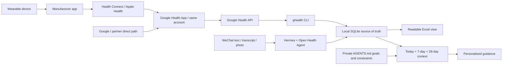

# Open Health Agent

[](skills/open-health-agent/scripts/oha/constants.py)
[](https://www.python.org/downloads/)
[](LICENSE)
[](https://github.com/w2478328197-arch/open-health-agent/actions/workflows/ci.yml)

[English](README_EN.md) · [简体中文](README.md) · [Security](SECURITY.md) · [Privacy](PRIVACY.md)

Connect Hermes, WeChat, Google Health, wearable devices, and Excel into a local-first personal fitness and wellness Agent.

Send a text message, a trustworthy voice transcript, or a meal photo in WeChat. The Agent records events that you explicitly confirm, or that satisfy the dedicated health-chat convention described below, in a private local ledger. Wearable data can be synchronized hourly. Before giving nutrition, training, recovery, or lifestyle advice, the Agent must read your latest health context and persistent goals instead of relying on chat memory alone.

> This is a personal wellness and fitness logging and decision-support project. It is not a medical device, diagnosis service, prescription service, or emergency service. For chest pain, severe difficulty breathing, fainting, new neurological symptoms, or another emergency, contact local emergency services first. Do not wait for the Agent to synchronize data or create a record.

## What you get

- A WeChat health entry point for text, reliable voice transcripts, and food or instrument photos that a vision-capable model can actually inspect.
- A private health record on your computer: SQLite is the reliable write and audit source; Excel is the human-readable view.
- Optional Google Health import for steps, sleep, exercise, active energy, and other mapped metrics, using an overlapping hourly lookback and idempotent updates.
- Persistent goals: the user's exact wording is stored in a private `AGENTS.md` and goal history.
- Evidence-aware advice: the Agent reads today's data so far, a seven-complete-day baseline, a 28-day trend, exercise, food, goals, missing data, and freshness before advising you.

Daily use does not require writing JSON. These are examples of messages you can send to the Agent in WeChat:

| What you send | What the Agent should do |
|---|---|
| `My goal is to get stronger, but I have high blood pressure.` | Save the exact goal and safety constraint first, then read health context and propose a safer strength path. |
| `Blood pressure was 128/82 this morning.` | Record systolic pressure, diastolic pressure, time, source, and original wording, then return the saved result. |
| `45 minutes of resistance training today, RPE 8.` | Write the workout, rebuild today's context, and adjust nutrition and recovery advice. |
| `I ate this for lunch` + a meal photo | When vision is genuinely available, estimate food identity, portion range, macronutrients, and only verifiable micronutrients; preserve confidence and uncertainty. |
| `How should I eat today, and should I still exercise?` | Read health context first, then tailor advice to a resistance, aerobic, rest, under-recovered, or incomplete-data day. |

## How data moves

The following is the typical path for third-party devices. Fitbit, Pixel, and some partner devices may use a Google first-party or direct partner path and may not pass through every intermediate layer.



[`ghealth`](https://github.com/Google-Health-API/google-health-cli) is a separate open-source CLI that queries the cloud [Google Health API](https://developers.google.com/health). It does not directly read Health Connect, Apple Health, Garmin Connect, or a watch. This project is not affiliated with or endorsed by Google, Hermes, Tencent, or any device manufacturer.

## What “supported” really means

“This brand is supported” never means “every metric from this brand can be imported.” A metric is usable only when all of the following are true:

1. The device sends the metric to its manufacturer app.
2. The manufacturer path writes it into a data source accepted by Google Health.
3. The metric is visible in the same Google Health account.
4. The user grants the corresponding read-only OAuth scope.
5. The Google Health API actually returns it.
6. The current Open Health Agent adapter maps that data type.

An empty response is missing or unavailable data, not zero. Never turn a missing HRV, sleep, SpO₂, exercise, or energy value into `0`.

### Device and manufacturer matrix

The matrix below summarizes Google's current [Connect other devices and apps to Google Health](https://support.google.com/googlehealth/answer/14236613?hl=en-GB) documentation. It is a practical routing guide, not a permanent compatibility promise. Availability can vary by phone OS, app version, region, device model, account, permission, and metric. Verify every metric you plan to use inside the user's own Google Health App before enabling the scheduler.

| Device or ecosystem | Typical route into Google Health | Metrics Google's current table says can be shared | Important current gaps or conditions |
|---|---|---|---|
| Fitbit / Pixel Watch | Google first-party device path | Steps, distance, sleep, exercise, and resting heart rate; supported models and regions may also provide HRV, SpO₂, and respiratory rate | Data depends on device capability, region, and eligibility. OHA does not currently map continuous heart rate, skin temperature, ECG, or irregular-rhythm notifications. |
| Apple Watch | Apple Watch → Apple Health → Google Health | Steps, floors, distance, energy, sleep and stages, exercise and routes, weight/body data, VO₂ max, heart rate, overnight HRV, SpO₂, breathing rate, resting heart rate, and temperature variation | Exercise minutes, stand hours, ECG/irregular-rhythm alerts, and all-day vitals are not listed as shared. Availability depends on Apple Watch model and Apple Health permissions. |
| Garmin | Garmin device → Garmin Connect → Health Connect or Apple Health → Google Health | Steps, distance, floors, energy, sleep, exercise summaries, heart rate, resting heart rate, and weight | HRV, breathing rate, SpO₂, skin temperature, VO₂ max, maps/routes, lap details, ECG, and irregular-rhythm alerts are not listed as shared. |
| Xiaomi / Mi Fitness | Xiaomi device → Mi Fitness → Health Connect on Android → Google Health | Exercise heart rate, steps, distance, energy, sleep, exercise summaries/maps, and weight | HRV, breathing rate, SpO₂, skin temperature, heart rate outside exercise, VO₂ max, and some minute/hour detail are not listed as shared. Check OS and region support. |
| Samsung Galaxy Watch | Galaxy Watch → Samsung Health → Health Connect → Google Health | Steps, distance, energy, sleep, exercise summaries, heart rate, SpO₂, VO₂ max, and weight | Floors, skin temperature, resting heart rate, HRV, breathing rate, routes/laps, alerts, and some minute/hour detail are not listed as shared. Samsung Health may require consent to health and wellness data processing. |
| Oura | Oura Ring → Oura app → Health Connect or Apple Health → Google Health | Steps, distance, sleep, exercise summaries, heart rate, HRV, and weight | Resting heart rate, breathing rate, SpO₂, skin temperature, VO₂ max, maps/routes, alerts, and some minute/hour detail are not listed as shared. |
| WHOOP | WHOOP → WHOOP app → Health Connect → Google Health; Android only | Exercise heart rate, steps, calories, distance, sleep, exercise summaries, resting heart rate, breathing rate, SpO₂, and weight | HRV, skin temperature, heart rate outside exercise, VO₂ max, routes/laps, alerts, and some minute/hour detail are not listed as shared. |
| Withings | Withings device → Withings app → Health Connect or Apple Health → Google Health | Only the metrics exposed by the current Withings-to-system-health integration | Google's current documentation says Withings blood pressure is not yet supported. Record unsupported blood pressure through WeChat or the local CLI instead. |
| Zepp / Amazfit | Amazfit device → Zepp app → Health Connect or Apple Health → Google Health | Steps, distance, energy, sleep, exercise summaries, heart rate, resting heart rate, weight, breathing rate, VO₂ max, SpO₂, and routes | Floors, HRV, skin temperature, lap details, ECG, and irregular-rhythm alerts are not listed as shared. |

The manufacturer matrix answers “can this value reach Google Health?” It does not answer “does Open Health Agent import it?” That second boundary is below.

### `ghealth`: 40 captured types and 14 semantic mappings

The pinned [`google-health-cli`](https://github.com/Google-Health-API/google-health-cli) registry exposes **40 Google Health API data types**. Open Health Agent checks all 40 and stores the ordinary JSON data points returned by `ghealth` in the SQLite capture layer. Steps, distance, active energy, and swim lengths retain both granular streams and daily rollups, for 44 capture queries in total.

The existing 14 semantic mappings still produce the stable daily, measurement, and workout views:

| Group | Semantic mappings |
|---|---|
| Daily activity rollups | `steps`, `distance`, `active-energy-burned`, `active-minutes` |
| Daily signals | `daily-resting-heart-rate`, `daily-heart-rate-variability`, `daily-oxygen-saturation`, `daily-respiratory-rate`, `daily-vo2-max` |
| Body measurements | `weight`, `body-fat`, `height` |
| Sessions | `sleep --detail`, `exercise` |

Other samples, ECG waveforms, alerts, and reference catalogs remain in the capture layer. Excel and Agent context expose only per-type coverage metadata. A field enters analysis only after explicit semantic mapping, unit validation, and rule review. A registered type may still be empty or fail because of the device path, account, region, OAuth scope, or API eligibility; never describe the 40 registered types as 40 metrics that a particular user necessarily has.

### Model, image, and voice matrix

Receiving a WeChat image or voice file is not the same as understanding it. The messaging channel, selected model, endpoint payload support, Hermes media routing, optional auxiliary tools, and provider permissions must all work together.

| Provider/model path | Direct image understanding | What is supported and what is not |
|---|---|---|
| OpenAI vision-capable GPT or Codex model | Yes, when the selected model/endpoint accepts image input and Hermes actually forwards the image | Do not assume every OpenAI or Codex model, login path, or host version has identical media support. ChatGPT OAuth is not an API key and does not prove image routing. Live-test the exact configuration. |
| Anthropic Claude vision-capable model | Yes, for models/endpoints that document image input | Text-only models or endpoints cannot inspect a photo. Hermes must still deliver the image in a supported form. |
| Google Gemini multimodal model | Yes, for models/endpoints that document image input | Model name, API version, file limits, and Hermes integration still need a live test. |
| DeepSeek direct API | No direct image input in the current text API | Text logging remains available. Hermes may use a separately configured auxiliary vision model or tool to inspect the image first, but that is a second provider path with its own privacy/data-processing boundary. Disclose and live-test it; never claim that the DeepSeek endpoint itself saw the image. |
| OpenRouter, Nous Portal, or another model aggregator | Depends on the selected downstream model and route | The aggregator name alone proves nothing. Verify that the exact model supports images and that the route preserves image input. |
| Self-hosted, Ollama, vLLM, or custom OpenAI-compatible endpoint | Depends on the loaded vision model and endpoint implementation | A text-compatible endpoint is not automatically image-compatible. Test the real request path and reject unsupported images honestly. |

As verified on July 14, 2026, DeepSeek's direct V4 API remains text-only. The compatibility aliases `deepseek-chat` and `deepseek-reasoner` are scheduled to retire on **July 24, 2026 at 15:59 UTC**; new configuration should use `deepseek-v4-flash` or `deepseek-v4-pro`. Changing the model name does not add image input.

Voice transcription is always a separate capability. A model that can see images does not automatically understand a WeChat SILK audio file. With the locally verified Hermes v0.18.0 Weixin path, a trustworthy transcript supplied by iLink can be used. If the inbound message contains only a cached `audio/silk/*.silk` file, Hermes's built-in transcription format gate does not accept SILK and rejects it before STT. Therefore this project does **not** promise automatic transcription of WeChat voice messages. Ask the user to type the information unless the exact deployment has an explicitly configured and tested SILK conversion/custom-STT path.

After every provider, model, gateway, or endpoint change, run three non-sensitive live tests:

1. Send plain text and confirm the Agent can read the ledger context.
2. Send one harmless test photo and ask for a concrete visible detail.
3. Send one harmless voice message and verify where the transcript came from.

Never write an endpoint into the “supported” column merely because its marketing page says “multimodal.” The exact deployed route must pass the test.

| Feature | Minimum requirement | Behavior when unavailable |
|---|---|---|
| WeChat text logging | Text model plus local file/command access | Works normally. |
| WeChat voice | Trustworthy iLink transcript, or an explicitly configured and tested SILK conversion/custom-STT path | Ask the user to type; never invent a transcript. Built-in Hermes v0.18.0 transcription does not directly accept a cached `.silk` file. |
| Food or instrument photos | Current model or vision tool can genuinely inspect the image | Ask the user to describe it; never pretend to have seen it. |
| Hourly wearable sync | Google Health, `ghealth`, and a computer background task | Manual records remain available. |
| iCloud Excel | iCloud Drive enabled on macOS | Store the workbook at an ordinary local path. |

## Before you start

Check the base dependencies:

```bash
git --version
python3 --version
```

The local ledger always requires Python 3.10+. Go 1.23+ is required **only when this repository builds `ghealth` from source**; manual-only mode, or a machine with a compatible `ghealth` executable already installed, does not need Go for OHA itself. A Google account, the Google Health App, and a Google Cloud OAuth client are required only when wearable import is enabled. Text-only manual logging does not require Google, WeChat, a vision model, or iCloud.

On a clean Mac, run `xcode-select --install` first, wait for Command Line Tools to finish, and reopen the terminal. It supplies Git for cloning this repository and building from source. Then install and verify Python 3.10+ from the [official Python downloads](https://www.python.org/downloads/). Install Go 1.23+ from the [official Go downloads](https://go.dev/dl/) only if you choose to build `ghealth` from source. Homebrew users may install these dependencies through Homebrew. On Linux, use the distribution package manager and verify the actual versions.

Microsoft Excel is not required to generate `.xlsx`. Excel, Numbers, LibreOffice, or another compatible application is only a viewer/export surface; rendering and round-tripping may differ between applications. Do not directly edit managed health sheets in any of them. SQLite remains the source of truth, and complex workbooks should be backed up before migration.

This guide uses `Asia/Shanghai` as an example, **not a copy-paste default**. First determine your real [IANA timezone](https://en.wikipedia.org/wiki/List_of_tz_database_time_zones), such as `Europe/Berlin` or `America/New_York`; do not use ambiguous abbreviations such as `CST`. Because the Hermes step requires reopening the terminal, Step 3 sets `OHA_TIMEZONE` again immediately before it is used. Whenever you open another terminal later, re-establish the variable and verify that it is non-empty before running a command that references it.

## Where should the Skill be installed?

Install the Skill into the Agent host that actually receives the user's messages.

- **For this WeChat architecture, Hermes is required.** Hermes owns the Weixin gateway, receives the message, invokes the Skill, and executes the local `open-health-agent` command. Therefore `--agent hermes` is not optional for the WeChat workflow.
- **Installing into Codex is optional.** It lets Codex maintain the project or use the same private ledger as another local host. It does not give Codex control of Hermes's Weixin gateway and cannot replace the Hermes installation for WeChat.
- WorkBuddy, Antigravity, Claude, or another host needs its own Skill installation only if that host will invoke the Skill. Its image, speech, local-command, and messaging capabilities must be tested independently.

For WeChat only, select `--agent hermes`. To make the same Skill available in both Hermes and Codex, repeat the option in the **same** installer run after cloning the repository in Step 3. Both hosts use the same private ledger by default; do not create two independent SQLite writers or two schedulers.

## From zero to running: Hermes + WeChat + Google Health

This is the reference path: a macOS or Linux computer runs Hermes, the ledger, and background services; an iPhone or Android phone handles the wearable/manufacturer sync, Google Health, and WeChat. The core ledger can in principle run on native Windows, but this repository does not yet promise the complete Windows background-scheduler experience.

### 1. Install and verify Hermes

On macOS, the recommended route is the [Hermes Desktop installer](https://hermes-agent.nousresearch.com/docs/getting-started/installation); Hermes documents that it installs both the Desktop UI and CLI, so do not run the CLI installer again. A headless macOS, Linux, or WSL2 host may install only the CLI. The WeChat path depends on the CLI and gateway; the Desktop window does not need to remain open. Close and reopen the terminal after installation, then verify:

```bash
command -v hermes
hermes version
hermes doctor
```

For a CLI-only installation, the more auditable route is to download the official script, inspect it locally, and then execute it:

```bash
HERMES_INSTALLER="$(mktemp)"
curl -fsSL https://hermes-agent.nousresearch.com/install.sh -o "$HERMES_INSTALLER"
less "$HERMES_INSTALLER"
bash "$HERMES_INSTALLER"
rm -f "$HERMES_INSTALLER"
command -v hermes
hermes doctor
```

The pipe form below is a convenience option that immediately executes whatever the server returns at that moment. Use it only after checking the official domain and accepting that trust boundary, preferably after reviewing the script:

```bash
curl -fsSL https://hermes-agent.nousresearch.com/install.sh | bash
```

Configure a model or login method:

```bash
hermes model
hermes
```

- For ChatGPT OAuth, select **OpenAI Codex** inside `hermes model`. This is not an OpenAI API key and is not the same as an API billing account.
- OpenAI API, DeepSeek, Gemini, and other providers are configured separately in `hermes model`. Capabilities and data-processing terms follow the actual provider and model.
- Before photo logging, send one non-sensitive test image and confirm that the current route can genuinely inspect it. If the selected DeepSeek endpoint is text-only, use text or configure a separate auxiliary vision model.
- Run `hermes tools` and confirm that the WeChat configuration can use Skills and Terminal/Files; when photos are needed, verify Vision as well. A minimal tool preset such as Blank Slate may be able to chat but unable to write the local ledger.

Official references: [Hermes installation](https://hermes-agent.nousresearch.com/docs/getting-started/installation) · [Provider configuration](https://hermes-agent.nousresearch.com/docs/integrations/providers) · [CLI commands](https://hermes-agent.nousresearch.com/docs/reference/cli-commands)

### 2. Connect WeChat safely

Hermes's personal WeChat adapter uses Tencent's iLink Bot API. Scanning the QR code creates a separate `...@im.bot` identity; it does not turn an ordinary personal WeChat account into a script-controlled account. Direct messages are usually more reliable than ordinary groups.

```bash
hermes gateway setup
```

Choose Weixin in the wizard, scan the QR code, and keep the `account_id` shown in the success message. Edit `~/.hermes/.env` before sending health information and set at least:

```dotenv
WEIXIN_ACCOUNT_ID=account-id-from-the-QR-flow
WEIXIN_DM_POLICY=pairing
WEIXIN_GROUP_POLICY=disabled
```

Start the gateway in the foreground and send only one non-sensitive test message from your own WeChat account. Hermes should return a pairing code:

```bash
hermes gateway run
```

In another terminal, approve that pairing and confirm that only the identity you approved appears:

```bash
hermes pairing list
hermes pairing approve weixin '<code-shown-by-Hermes>'
hermes pairing list
```

Send a second non-sensitive message and confirm that your account gets a normal Agent response. If a second unapproved account is available for a negative test, it may enter the pairing flow but must not receive an Agent health response. Leaving `WEIXIN_DM_POLICY=pairing` authorizes only approved users. If you deliberately switch to `allowlist` later, copy the full user ID only from `hermes pairing list`; ordinary Weixin gateway logs redact or truncate IDs and cannot be used to reconstruct an allowlist.

Return to the original terminal running `hermes gateway run`, press `Ctrl-C`, and confirm that the foreground gateway has exited. The same Weixin token cannot be used by foreground and background gateway processes at the same time.

Install and check the background gateway:

```bash
hermes gateway install
hermes gateway start
hermes gateway status
```

The current Hermes Weixin default for direct messages is `open`; do not leave that default in place for health use. Pairing and allowlists are inbound access controls, not invitation systems. See the complete [Hermes Weixin documentation](https://hermes-agent.nousresearch.com/docs/user-guide/messaging/weixin) and [Hermes pairing commands](https://hermes-agent.nousresearch.com/docs/reference/cli-commands#hermes-pairing). If the wizard reports missing `aiohttp` or `cryptography`, install the messaging dependencies described on that official page and retry.

Weixin/iLink availability depends on the current Hermes version, Tencent account, and region. If Weixin is absent from the wizard, QR login fails, or iLink is unavailable to the account, do not bypass access controls. Use Hermes CLI or the manual ledger mode while troubleshooting against current official documentation.

WeChat may deliver an image or voice file without the model being able to understand it. On the locally verified Hermes v0.18.0 path, an iLink-provided transcript is usable, but an inbound voice message without that transcript may be only a cached `audio/silk/*.silk` file. The built-in transcription format gate does not accept SILK and rejects it before STT. Ask for text unless an explicit conversion/custom-STT path has been configured and tested. A text-only model cannot inspect an image.

### 3. Install Open Health Agent: choose one path and run it once

Set and verify the timezone in this newly reopened terminal. Replace the example with your actual IANA timezone:

```bash
OHA_TIMEZONE='Asia/Shanghai'
test -n "$OHA_TIMEZONE" && printf 'OHA timezone: %s\n' "$OHA_TIMEZONE"
```

OHA does not recommend a `curl | bash` installation. Prefer cloning the repository, inspecting the exact revision, and running the local installer from that revision:

```bash
git clone --no-checkout https://github.com/w2478328197-arch/open-health-agent.git
cd open-health-agent
git fetch --tags --force
git tag --list
# If you have reviewed a release tag, replace origin/main below with that tag:
git checkout --detach origin/main
git show --stat --oneline HEAD
less install.sh
```

Use `git rev-parse HEAD` to record the exact installed commit. A release tag still needs a trusted provenance check; when no reviewed tag is available, pinning and reviewing one commit is more auditable than executing a mutable remote script. To upgrade later, return to the clone, fetch the new tag/commit, review the diff, and then rerun the installer.

Option A — WeChat through Hermes, with the default local Excel path:

```bash
./install.sh --agent hermes --timezone "$OHA_TIMEZONE"
```

Option B — WeChat through Hermes and optional local use from Codex, with the default local Excel path:

```bash
./install.sh --agent hermes --agent codex --timezone "$OHA_TIMEZONE"
```

Option C — place only the Excel view in iCloud Drive on macOS; add `--agent codex` to the same command only if you also want the Skill in Codex:

```bash
./install.sh \
  --agent hermes \
  --timezone "$OHA_TIMEZONE" \
  --workbook "$HOME/Library/Mobile Documents/com~apple~CloudDocs/Open Health Agent/Health Ledger.xlsx"
```

Do not run A and then B or C. The installer protects an existing private configuration; a second ordinary installation will not overwrite the workbook path or timezone. Option C works only on macOS and requires iCloud Drive to be enabled in System Settings first.

The installer puts the command in `~/.local/bin` by default. If the current terminal cannot find `open-health-agent`, run:

```bash
export PATH="$HOME/.local/bin:$PATH"
```

This affects only the current terminal. To keep it, add the same line to `~/.zshrc` or `~/.bashrc`; alternatively, always use the complete `Command:` prefix printed by the installer. Background launchd/systemd services normally do not read interactive shell startup files, so do not rely on a temporary `PATH`, `~`, or `$HOME` expansion in a service definition. For background configuration and Agent troubleshooting, copy the installer's complete absolute `Command:`. An interactive terminal success does not replace a live WeChat test.

After every OHA Skill install or update, restart the Hermes gateway so the background process reloads the Skill and command, then verify its status:

```bash
hermes gateway restart
hermes gateway status
```

If the project was already installed and you now need to change the timezone, move the view to iCloud, or select an existing `.xlsx`, run:

```bash
open-health-agent init --force \
  --timezone "$OHA_TIMEZONE" \
  --workbook "$HOME/Library/Mobile Documents/com~apple~CloudDocs/Open Health Agent/Health Ledger.xlsx"
```

`init --force` backs up and updates only the configuration fields you explicitly provide. It does not delete SQLite, goals, or private records. If the new path points to an empty file, custom sheets from the old workbook are not automatically moved. If it points to an existing `.xlsx`, ordinary custom sheets are preserved where possible. Back up complex workbooks first: managed health sheets are rebuilt from SQLite, while macros, embedded objects, slicers, and vendor extensions are not guaranteed to round-trip perfectly.

Verify the local ledger and Skill:

```bash
open-health-agent doctor
hermes chat -q "/open-health-agent Explain this Skill first, then check whether my health ledger is ready"
```

A compliant first response explains local storage, the data path, image/voice requirements, third-party processing, uncertainty, and the non-medical boundary before performing the requested check. If the first message describes an emergency, emergency guidance takes priority over explanation, sync, or logging.

After confirming that the explanation was actually delivered, record its local audit timestamp:

```bash
open-health-agent onboarding status
open-health-agent onboarding mark-explained --delivery-confirmed
```

This timestamp is installation audit information. It never allows the Agent to skip the first-use explanation in a future new conversation.

If the workbook is in iCloud, OneDrive, Dropbox, or another recognized synchronization folder, obtain separate cloud-workbook consent before any health-bearing Excel projection:

```bash
open-health-agent onboarding grant-consent --scope cloud-workbook
```

An ordinary local workbook does not need this scope. Without it, records, goals, deletes, and syncs may still commit successfully to SQLite, but health data is not projected into the cloud workbook. Commands report `*_export_pending` or `workbook_export=blocked_by_consent`, and `context`/`doctor` report a pending projection. After consent, run `open-health-agent export` to rebuild Excel from SQLite. To make a Google foreground sync qualify for scheduler installation, grant cloud-workbook consent first and complete a new real sync; exporting afterward does not retroactively qualify the earlier sync.

`cloud-workbook` and `cloud-private-home` are independent scopes, each bound to the exact provider/path fingerprint. A new private home must use ordinary local storage. When upgrading a legacy installation whose private home or SQLite database already lives in iCloud, OneDrive, Dropbox, or another synchronized directory, health writes pause until the private home is migrated back to local storage or the user explicitly grants legacy continuation for that current synchronized location:

```bash
open-health-agent onboarding grant-consent --scope cloud-private-home
```

Moving the private home, database, or workbook, or switching sync providers, invalidates the old cloud scope. Revoking a scope does not delete provider-side copies or disable operating-system synchronization. Even with `cloud-private-home`, projecting the workbook to a cloud folder still requires separate `cloud-workbook` consent.

If Google Health will be connected next, first obtain the user's explicit consent for that external data path and record its scope:

```bash
open-health-agent onboarding grant-consent --scope google-health
```

This local consent record does not sign into Google, change OAuth permissions, or install a background job. The command refuses consent when explanation delivery has not been confirmed. The repository installer also **never installs the scheduler automatically**.

### 4. Connect Google Health on the phone

Manual-only mode can skip this section, `ghealth`, and the scheduler.

1. Install and sign into the Google Health App according to its [official setup requirements](https://support.google.com/product-documentation/answer/14226283?hl=en): it currently requires Android 11+ or iOS 16.4+, subject to account, region, and store availability. It is a phone app, not a watch app; do not confuse it with legacy Google Fit or the Android Health Connect data bridge.
2. Let the device synchronize into its manufacturer app, such as Mi Fitness, Garmin Connect, Samsung Health, Oura, or another supported app. In the manufacturer/system-health layer, enable only the data-type permissions you need.
3. Android commonly follows “manufacturer app → Health Connect → Google Health”; iPhone commonly follows “manufacturer app → Apple Health → Google Health.” Some partners connect directly. In Google Health, open **Connections → Partner apps / Apps and services** and follow Google's [official third-party connection steps](https://support.google.com/googlehealth/answer/14236613?hl=en).
4. Trigger one manufacturer synchronization, then confirm the connection under Google Health **Connections → Connected** and verify each target metric—steps, sleep, exercise, HRV, and so on—rather than only the app name.
5. If a metric is missing, inspect each hop—device → manufacturer app → Health Connect/Apple Health → Google Health—for permission, synchronization time, region, system version, and brand support. An hourly job cannot fetch data that never reached Google Health.

### 5. Install and authorize `ghealth`

The repository build script requires Git and Go 1.23+. It builds `ghealth` from a pinned upstream source revision:

```bash
go version
./scripts/install_ghealth.sh --dry-run
./scripts/install_ghealth.sh
export PATH="$HOME/.local/bin:$PATH"
ghealth setup --instructions
```

The repository checks the upstream default branch every six hours. When a new commit appears, automation updates the immutable source pin, writes an auditable [upstream sync note](docs/ghealth-upstream-updates.md), and runs the upstream Go tests, a clean build, the 40-type/44-query capture contract check, and the complete OHA regression suite. The generated pull request is merged only after every gate passes. Upstream currently publishes no releases or tags, so tracking is commit-based. This does not broaden OAuth scopes or silently replace a binary on a user's machine, because that would change the scheduler's security-bound runtime fingerprint and requires a separate local upgrade acceptance flow.

Follow the instructions emitted by `ghealth`, enable the Google Health API in Google Cloud, and create an OAuth client ID. For this CLI, choose **Desktop application**. Under the OAuth consent screen, use **Data Access → Add or remove scopes** to add these six scopes; while the project is in Testing, also add the actual synchronizing account under **Audience → Test users**:

- `https://www.googleapis.com/auth/googlehealth.activity_and_fitness.readonly`
- `https://www.googleapis.com/auth/googlehealth.health_metrics_and_measurements.readonly`
- `https://www.googleapis.com/auth/googlehealth.sleep.readonly`
- `https://www.googleapis.com/auth/googlehealth.nutrition.readonly`
- `https://www.googleapis.com/auth/googlehealth.ecg.readonly`
- `https://www.googleapis.com/auth/googlehealth.irn.readonly`

These are the minimum scope categories for the current 40-type capture registry. ECG and irregular-rhythm access use separate sensitive scopes; an ineligible account or project will leave those queries failed and the sync `partial`, while successful types still commit. Upstream's broader `readonly` preset also asks for profile, settings, and location, which OHA does not read. Download the client-secret JSON, then run:

```bash
ghealth setup --scopes activity_and_fitness.readonly,health_metrics_and_measurements.readonly,sleep.readonly,nutrition.readonly,ecg.readonly,irn.readonly
ghealth auth status --validate
ghealth config set timezone "$OHA_TIMEZONE"
```

`ghealth setup` uses a local loopback callback with PKCE for browser authorization. The `--scopes` flag limits the local request; it cannot edit Google Cloud Data Access for you. Google's generic API setup page also describes a **Web Server** client and a `https://www.google.com` redirect URI for developers writing their own API client. That is a different flow and must not replace the Desktop client required by this CLI.

If the account, region, or project cannot enable the Google Health API, full wearable mode cannot continue; WeChat/CLI manual logging still works.

A computer without a graphical browser still uses the same Desktop client:

```bash
ghealth auth login --non-interactive --scopes activity_and_fitness.readonly,health_metrics_and_measurements.readonly,sleep.readonly,nutrition.readonly,ecg.readonly,irn.readonly
# Open auth_url privately in your own browser. Copy only the code query parameter:
ghealth auth login --complete '<code>'
ghealth auth status --validate
```

`ghealth` stores its client and plaintext token under `~/.config/ghealth/`; upstream sets owner-only file permissions. After successful validation, you may delete redundant copies of the client JSON from Downloads, but do not delete the managed `ghealth` configuration directory. Never paste a client secret, authorization URL, code, token, or complete configuration output into chat, an Issue, or Git.

When the Google consent screen remains in Testing, a refresh token may expire after about seven days. That is an authorization failure, not evidence that the account has no health data. Re-run `ghealth auth login --scopes ...` with the same three minimum scopes, followed by `auth status --validate`, a manual `sync`, and a scheduler check.

Run a small step query for the last two dates. In the pinned version, `--to` includes the named date:

```bash
ghealth data steps daily-rollup --from yesterday --to today
```

An empty result may mean there were genuinely no steps, or that device, account, scope, and synchronization are not connected. A successful step query proves only steps. Sleep, exercise, HRV, and every other target metric must be visible in Google Health and validated through its corresponding `ghealth` query or the later OHA `sync`/`context` flow.

### 6. Run the first synchronization and inspect Excel

OHA and `ghealth` must use the exact same IANA timezone. Then run, in order:

```bash
open-health-agent doctor
open-health-agent sync
open-health-agent context
```

Synchronization uses a two-phase lock design. It briefly holds the writer lock only for local consent, configuration, date-range, and local runtime preflight checks. Potentially slow `ghealth` profile, account, timezone, fingerprint, and network calls run outside the writer lock. After fetching, OHA rechecks external identity outside the lock, then briefly reacquires the lock to confirm local authority, configuration, dates, and fingerprints still match before writing SQLite. Network waits and external validation therefore do not monopolize manual WeChat logging. If consent, configuration, or identity changes while the fetch is in flight, the whole fetched batch is rejected before persistence and must be retried.

Check all four points:

- Local ledger checks pass in `doctor`. Before a scheduler is enabled, some `ghealth` checks remain optional, so an overall `ok` alone does not prove that the wearable path works.
- `ghealth auth status --validate` and the small current-day step query genuinely pass.
- Inspect `status`, `workbook_export`, `errors`, and counts in the `sync` JSON. Individual metric queries may fail even when the process exits normally. Complete acceptance requires both `status=success` and `workbook_export=succeeded`. Investigate `partial`, `failed`, `empty`, and `blocked_by_consent`; missing values cannot become zero, and a SQLite-only result cannot authorize scheduler installation.
- Excel contains managed sheets for daily health, workouts, measurements, food logs, daily nutrition summaries, goal history, synchronization logs, and related views.

`open-health-agent context` is the standard “read the health table” operation before advice. It reads SQLite, the same source that generates Excel; it does not ask the model to guess from or freely edit arbitrary `.xlsx` cells.

### 7. Enable hourly synchronization and AC-power wakefulness

If the machine already has a cron, launchd/systemd job, legacy importer, or Hermes/openpyxl path that saves the health workbook directly, first follow the [one-writer migration checklist](docs/migration.md) to inventory, stop, back up, and cut over those writers. Do not install a new job while dual writing may still occur.

Install the hourly job only after explanation delivery is confirmed, active `google-health` consent is recorded, and a real `open-health-agent sync` has run as the **same operating-system user, with the same Google profile, authenticated account, Cloud project, timezone, and OHA runtime**. Its JSON must explicitly report `status=success`. `--fixture` exists only for synthetic tests; neither a fixture sync nor a scheduled run can create installation evidence. A zero process exit code or an overall `doctor` result of `ok` does not replace this real foreground acceptance check.

Within **30 minutes** after that successful real manual sync, obtain a fresh one-shot `scheduler` consent and install immediately:

```bash
open-health-agent onboarding grant-consent --scope scheduler
open-health-agent scheduler install --interval-seconds 3600
open-health-agent scheduler status
```

Scheduler consent is one-shot: it is consumed before the operating-system job mutation begins. If that later installation step fails, a retry still needs fresh consent. If the 30-minute window expires, the SQLite evidence no longer matches, or the runtime changes, complete another real manual sync and obtain a new consent. The repository installer performs none of these actions on the user's behalf.

The scheduler binds the `ghealth` executable, Python runtime, OHA entry point and code, active profile, authenticated account, Cloud project, granted scopes/authentication method, and IANA timezone. It also writes a managed scheduled-only marker. The one-shot grant approves only the installation action; after a successful install, OHA separately binds ongoing runtime authorization to the qualifying foreground sync's static-runtime fingerprint plus account-bound runtime fingerprint. Every background run verifies active consent, that installed authorization, and both opaque fingerprints before any health query; drift is rejected instead of silently falling back to another profile, account, project, or code version.

Revocation invalidates runtime authorization in durable local state before OHA attempts to remove the operating-system job. Therefore, even if job removal fails and leaves an orphan definition, it cannot continue fetching health data. Granting scheduler consent again after revocation does not resurrect that orphan; a new qualifying real manual sync and successful reinstall are required to create new installed authorization. Older OHA jobs lack these fields and must be removed with `open-health-agent scheduler uninstall`, followed by “real manual sync → fresh one-shot consent → install.” Do not hand-edit an old plist or service to make it appear current.

If a manual sync succeeds only through a local proxy, explicitly give the background definition the same route. Add `--inherit-proxy-env` to copy only allowlisted HTTP/HTTPS/ALL/NO_PROXY variables from the install process, or use `--proxy-env-file <owner-only-file>`. On macOS/Linux that file must be owned by the current user, owner-readable only, and contain only those proxy keys apart from comments or blank lines. Each HTTP/HTTPS/ALL proxy URL must target `localhost` or a loopback IP, include a valid port, and contain no credentials, path, query, or fragment. Remote proxies and general-purpose `.env` files are rejected. `scheduler status` reports only key names, never addresses or values. Omit both options when no proxy is required.

Immediately after installation, `status` proves only that the job definition and service exist; it does not prove an automatic sync. Before installing, note the latest timestamp in Excel's synchronization log. After installing, do not trigger another manual `sync`: keep the installing user signed in, the computer awake, and the network available until a log entry appears **after the installation time**. Run `scheduler status` and `open-health-agent context` again. Use `last_scheduled_sync_status`, `last_scheduled_sync_at`, `last_successful_scheduled_sync_at`, and `last_scheduled_sync_error_code` for acceptance; `last_any_*` may describe a manual sync and cannot prove an automatic run. `scheduled_trigger_pinned`, `runtime_fingerprint_matches`, and the other configuration checks must also pass. `recent_manual_ghealth_sync_eligible` only says that current foreground evidence can still authorize one install; it does not mean the scheduler has run.

The Hermes gateway and health scheduler are two separate services:

- The Hermes gateway receives WeChat messages and lets the Agent invoke the Skill.
- The Open Health Agent scheduler reads Google Health hourly, writes SQLite, and safely exports Excel.

Both must run as the same trusted operating-system user. Disable any old cron job, importer, or second Excel writer.

This is an approximately every-3600-seconds schedule, not a promise to run exactly at the top of each clock hour. Network loss, sleep, expired OAuth, and upstream delay may cause failure, partial success, or latency; a failure is never relabeled as success, and the service tries again at a later interval. After restoring network/authorization, verify a real manual `sync`. If the job actually needs reinstalling, obtain fresh one-shot `scheduler` consent and run `install` within 30 minutes of that success, then repeat the automatic-run acceptance above. Later jobs deliberately use an **overlapping data lookback window** to recover late data and deduplicate it; this is not permission to run two schedulers or two Excel writers.

macOS launchd and the Linux systemd user timer belong to the user who installed them. A macOS user job normally runs only after that user signs in. After an operating-system reboot, sign in, check both `hermes gateway status` and `open-health-agent scheduler status`, and wait for a new automatic-sync record. Restart the Hermes gateway if it did not recover. If the scheduler definition or runtime fingerprint no longer matches, the old job refuses health queries; uninstall it, then follow “real manual sync → fresh one-shot consent → install.”

This version does not send an OAuth-expiry alert. While Google Cloud remains in Testing, run `ghealth auth status --validate` and `open-health-agent scheduler status` at least weekly. Investigate whenever the last successful synchronization is older than two configured intervals—about two hours for the hourly schedule—instead of discovering a stale ledger days later.

A fully sleeping Mac will not continuously execute hourly jobs. When plugged in, go to **System Settings → Battery → Options** and enable the option that prevents automatic sleep on the power adapter while the display is off, and keep a MacBook open. Or use the project's reversible AC-only helper:

```bash
open-health-agent onboarding grant-consent --scope keep-awake
open-health-agent keep-awake-on-ac install
open-health-agent keep-awake-on-ac status
```

Like scheduler consent, a `keep-awake` grant is one-shot and can be used for only one installation attempt within 30 minutes after it is granted. Expiry, prior consumption, or a failed install requires new user consent. It does not authorize Google, the scheduler, or a cloud workbook.

It prevents idle system sleep only while connected to AC power and does not guarantee operation with a closed lid. Remove it and the scheduler with:

```bash
open-health-agent keep-awake-on-ac uninstall
open-health-agent scheduler uninstall
```

Linux uses a systemd user timer. Whether it continues after logout depends on user linger; trust the result of `scheduler status`, not an assumption.

Withdraw a local permission with its explicit scope. Revoking `scheduler` also attempts to remove the managed job:

```bash
open-health-agent onboarding revoke-consent --scope scheduler
open-health-agent onboarding revoke-consent --scope google-health
```

Local revocation prevents OHA from using that capability, but it does not revoke the Google-side token or disable Hermes Weixin, vision, speech, or another host channel. Revoking `cloud-workbook` stops later cloud projections but does not delete an existing provider copy or disable synchronization. Disable, revoke, or delete each external provider/host artifact separately. `open-health-agent scheduler uninstall` also revokes scheduler consent.

## First end-to-end acceptance test in WeChat

Run these steps in order before calling the system fully usable:

1. Send `/open-health-agent I want to start using my health ledger`. The Agent should explain the Skill first and then continue.
2. Send a new goal, for example, “My goal is to get stronger, but I have high blood pressure.” The Agent should save the exact wording and safety constraint before planning.
3. Send “Blood pressure was 128/82 this morning.” The Agent should state whether it was saved, return the record ID, and show the stored values.
4. Send “45 minutes of resistance training today, RPE 8.” The Agent should write the workout and adjust later advice for a training day.
5. Send “I ate this for lunch” with a non-sensitive meal test photo. The Agent should briefly echo the recognized intake before recording a portion range, estimation source, and confidence.
6. Send one voice message. It should be recorded only if a reliable transcript or STT exists; otherwise the Agent should ask you to type it.
7. Ask, “How should I eat today, and do I still need to exercise?” The response should state the data cutoff, whether today is complete, sync freshness, and reflect both today's training and your goal.
8. Open Excel and confirm that the records exist. Run `open-health-agent context` once more and confirm that the machine-readable context contains them too.

If Hermes in WeChat cannot find `open-health-agent`, tell it to use the complete `Command:` prefix printed by the installer—the default executable is `~/.local/bin/open-health-agent`—then restart the gateway and retry. The background command environment is proven only after WeChat completes one real write and one context read.

The safe open-source default is that **a bare photo does not by itself prove consumption**. Initially include “I ate this,” or explicitly say once, “In this dedicated health conversation, a close-up meal photo by itself means I consumed it and want it logged.” Only after that choice is saved in the private `AGENTS.md` may the Agent omit repeated confirmation. It must still echo the recognized items, portion range, and confidence first. A shopping cart, menu, recipe, price label, unopened item, future plan, or background object must never be logged as consumed; if identity is genuinely unclear, ask one necessary short question.

## What the Skill requires every Agent to do

### Explain the Skill at the start of every new conversation

Except in an emergency, the first use of this Skill in every new conversation on any compatible Agent Skills host must briefly explain, in the user's language:

1. What SQLite, Excel, and the private goal file each store.
2. Which third parties and intermediate layers carry wearable data.
3. Which capabilities text, voice, and images each require.
4. What may be processed by WeChat/Tencent, device manufacturers, Apple/Android health layers, Google, model/STT/vision providers, and any chosen cloud-drive provider.
5. Uncertainty in photo nutrition estimates and wearable measurements.
6. That the Agent reads current local health context before every recommendation.
7. That the project is not a medical or emergency service.

When the user has already requested installation, synchronization, or logging, continue with that action after the explanation. Do not stop and ask again for the same action without a reason. Emergency handling always comes first.

### Fixed write and advice order

```text
New user goal → save exact wording and safety constraint
New user data / new ghealth data → persist workbook-projection outbox marker
                                 → write SQLite → export Excel with consent → clear pending marker
Advice requested → open-health-agent context
                 → inspect cutoff, freshness, missing data, and day completeness
                 → advise under the goal and safety constraints
```

- Rebuild context after every new write; never continue from stale context.
- If context fails, is stale, or lacks key fields, give only conservative, conditional general guidance. Do not claim personalization.
- Label today's data “so far.” Compare it with a seven-complete-day baseline and a 28-day trend.
- Nutrition, activity, hydration, and recovery guidance must differ for resistance, aerobic, rest, under-recovered, and incomplete-data days.
- Correct the original record for the same event; do not append a contradictory duplicate.

### The user's goal is the highest persistent project-level instruction

When the user states, changes, pauses, or withdraws a health or fitness goal, save the exact wording to the private `AGENTS.md`, goal history, and profile before planning. It is the project's highest persistent user instruction, but it remains below system rules, emergency safety, and medical boundaries.

When a goal conflicts with health risk, do not silently discard either side. For example, “get stronger despite high blood pressure” should preserve the strength goal while avoiding default recommendations for maximal loads, failure training, breath-holding/straining, or unevaluated high-intensity work, and should offer a safer progression. With no explicit goal, use “improve health” as the temporary goal and apply age- and life-stage-appropriate [WHO physical activity guidance](https://www.who.int/news-room/fact-sheets/detail/physical-activity) as the cold-start baseline.

## Energy and nutrition rules

Use the Cunningham 1991 fat-free-mass equation for resting energy only after the user confirms lean body mass:

```text
Estimated REE = 370 + 21.6 × lean body mass (kg)
```

When the device field is explicitly `active_only` energy:

```text
Planned intake = (estimated REE + complete-day average active energy + goal adjustment)
                 / (1 - TEF fraction)
```

- Estimate TEF ranges around 20–30% for protein, 5–10% for carbohydrate, and 0–3% for fat.
- If the device reports total energy that already includes resting expenditure, or if PAL is used, do not add REE, exercise energy, or TEF again.
- Do not “eat back” watch or single-workout calories 1:1. Use a range and state the measurement error.
- A photo can estimate only visible food and portion size. Hidden oil, recipes, weights, sodium, and complete micronutrients are usually not fully knowable.
- The local CLI validates and stores nutrition fields supplied by the Agent or a reliable source; it does not contain an authoritative photo-nutrition database. Leave unsupported micronutrients empty and report coverage. Never invent zeroes.

See [health rules](skills/open-health-agent/references/health-rules.md) for calculation and safety references.

## Excel, SQLite, and custom metrics

- SQLite is the only write and audit source of truth. Excel is a readable view generated from the same data.
- The standard Agent action for “read the health table” is `open-health-agent context`, not free-form scanning of arbitrary Excel cells.
- A blood-pressure monitor, glucose meter, grip-strength device, waist measurement, or another metric not connected to Google Health can enter the measurement ledger through WeChat text, a trustworthy voice transcript, a readable instrument photo, or CLI.
- To affect advice, a custom metric must be written as a structured Agent/CLI record. Ordinary sheets that the user adds to Excel are preserved where possible but do not automatically enter context or recommendations.
- Managed health sheets are not a second write source. Ask the Agent to update the original record and re-export when correcting data.
- Before any operation can durably change SQLite, it persists a workbook-projection outbox marker. Only a successful atomic Excel export clears that marker after the database commit. A crash, file lock, permission error, or missing `cloud-workbook` consent leaves a recoverable pending state instead of rolling back or hiding the successful canonical write; resolve the cause and run `open-health-agent export` to rebuild the view.
- When using iCloud, synchronize only the Excel view and explicitly grant `cloud-workbook` before its first health-bearing projection. Keep SQLite, `AGENTS.md`, OAuth tokens, photos, and logs in the private local directory. If a legacy installation already has its private home in a synchronized folder, `cloud-private-home` is only a temporary exact-bound legacy authorization; prefer migrating it back to local storage.
- The default private directory is `~/.open-health-agent`. On supported systems the installer applies owner-only directory and file permissions, but SQLite and configuration are not encrypted at rest by the project. Enable FileVault, LUKS, or equivalent full-disk encryption and secure the operating-system account.
- Close Excel/Numbers during the first synchronization, migration, or repair so it and iCloud do not become another writer. Normal viewing is fine, but do not directly edit values in managed health sheets. An iCloud conflict copy is not a substitute for the SQLite source of truth.

See the [ledger specification](skills/open-health-agent/references/ledger-schema.md) for field definitions and copyable CLI examples.

### Backup and decommissioning

Before each sync, record, delete, or goal change, the CLI uses SQLite's online backup API under the shared lock and keeps the configured bounded retention (14 snapshots by default). Run `open-health-agent backup` for a manual consistent snapshot; its default response hides the local path, while `--verbose-path` is reserved for terminal diagnostics. These snapshots are permission-restricted but are not independently encrypted.

For a complete encrypted recovery copy, still stop the Hermes gateway, uninstall the scheduler, and confirm that no other writer remains before copying the entire private data directory into controlled encrypted storage. An Excel-only cloud copy cannot restore audit state. After restoration, run `doctor`, `export`, and `context` before re-enabling services.

To decommission completely, run:

```bash
open-health-agent scheduler uninstall
open-health-agent keep-awake-on-ac uninstall
hermes gateway stop
hermes gateway uninstall
ghealth auth logout
```

Then revoke access in the Google account/Cloud project, disconnect Weixin using Hermes's official procedure, and—after confirming the backup—remove `~/.open-health-agent`, `~/.config/ghealth`, the selected iCloud workbook, and any Hermes media caches that are no longer needed. Do not delete the entire `~/.hermes` directory and accidentally destroy unrelated Hermes configuration.

## WorkBuddy, Antigravity, and other Agent hosts

The Skill's behavior rules are portable, but the repository installer currently has built-in `--agent` targets only for Hermes, Codex, and Claude. For WorkBuddy, Antigravity, or another host:

1. Use that host's standard Skill installation method, or install to an explicit Skill directory:

   ```bash
   ./install.sh --skill-dir '/path/to/that/host/skills' --timezone "$OHA_TIMEZONE"
   ```

2. Verify that the host can read `SKILL.md` and the private `AGENTS.md`, and can execute the local `open-health-agent` command.
3. Test images, voice transcription, WeChat/messaging, and durable background execution separately. A host name is not evidence that these capabilities work.

You may also install only the standard Skill instructions:

```bash
npx --yes skills add w2478328197-arch/open-health-agent --agent '*'
```

This optional route requires Node.js/npm on the host. It does not install the Python ledger, Excel template, `ghealth`, or scheduler. Clone the repository and run the installer once for full functionality.

## Acceptance checklist

- [ ] The first use in every new conversation explains the Skill; an emergency message receives safety handling first.
- [ ] Hermes ordinary chat, Skills, and Terminal/Files work.
- [ ] WeChat DM policy is pairing or an own-user allowlist; groups are disabled.
- [ ] Images and voice have each passed a real capability test.
- [ ] The Google Health phone app shows every target metric.
- [ ] `ghealth auth status --validate` passes, and OHA and `ghealth` use the same timezone.
- [ ] A synchronized workbook has separate exact-bound `cloud-workbook` consent; if a legacy private home is synchronized, it has been migrated local or separately granted exact-bound `cloud-private-home`; `doctor`/`context` shows no pending workbook projection.
- [ ] Explanation delivery and `google-health` consent are recorded; within 30 minutes of a successful real manual `open-health-agent sync`, the scheduler is installed with fresh one-shot consent.
- [ ] Scheduler status shows active consent and matching static/account runtime fingerprints, and the first scheduled success exercises installed authorization; an orphan cannot run after revocation.
- [ ] `open-health-agent context` reports cutoff, freshness, goals, and data gaps.
- [ ] Goal, blood pressure, workout, and meal-photo records are visible in Excel.
- [ ] Shopping, menus, and plans are not mistaken for consumed food; repeated sync does not create duplicate rows.
- [ ] Real health data, Excel workbooks, images, voice files, OAuth files, and API keys never enter Git.

## Documentation and privacy

- [Hermes, model, and WeChat configuration](docs/hermes.md)
- [Complete installation and onboarding](skills/open-health-agent/references/installation.md)
- [Legacy Excel / Hermes one-writer migration checklist (Chinese)](docs/migration.md)
- [Data sources and OAuth](skills/open-health-agent/references/data-sources.md)
- [Architecture and consistency](docs/architecture.md)
- [Compatibility](docs/compatibility.md)
- [Ledger schema](skills/open-health-agent/references/ledger-schema.md)
- [Health rules](skills/open-health-agent/references/health-rules.md)
- [Privacy notice](PRIVACY.md)
- [Security policy](SECURITY.md)

Real health data, goals, images, voice, logs, databases, Excel workbooks, OAuth files, and API keys are excluded from Git. Issues and tests must use synthetic data only. Report vulnerabilities privately according to [SECURITY.md](SECURITY.md).

Licensed under the [Apache License 2.0](LICENSE).
