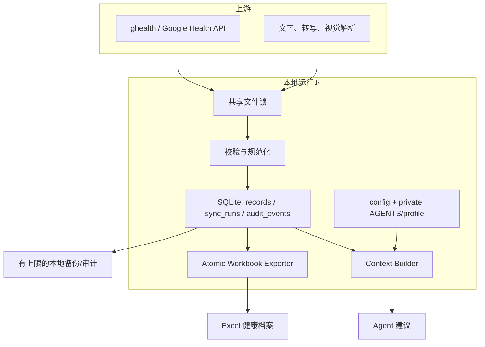
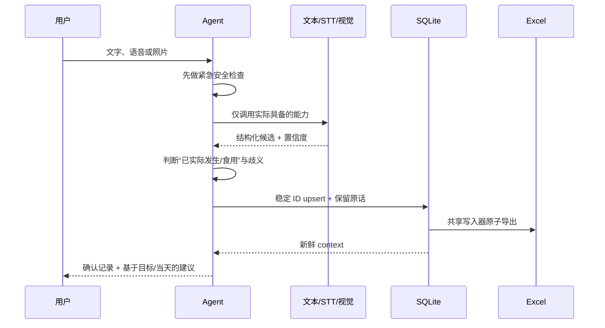

# 架构与一致性

## 设计目标

- 本地持有可审计真源；外部服务只处理用户选择发送的数据。
- 定时同步、微信录入和手动命令走同一写入路径。
- 同一源记录可重复导入而不产生重复行。
- Excel 方便阅读和跨设备查看，但不会成为并发数据库。
- 每次建议都由可复现的 context 生成，不依赖模糊聊天记忆。

## 组件



## 私有数据目录

默认 `~/.open-health-agent`，可由 `OPEN_HEALTH_AGENT_HOME` 覆盖。典型内容：

```text
~/.open-health-agent/
├── AGENTS.md          # 目标原话与最高项目内用户规范
├── profile.json       # 计算输入、生命周期、约束、目标历史
├── config.json        # 时区、路径、ghealth 命令、能量口径
├── state.json         # onboarding 与最近同步状态
├── health.sqlite3     # 写入与审计真源
├── 健康档案.xlsx       # 用户持有的可读导出视图，可按用户选择放 iCloud
├── backups/           # 有上限的本地备份
├── locks/             # 单写入器锁
├── logs/              # 脱敏运行状态
└── raw/               # 有限保留的非载荷同步摘要（不含完整 ghealth 响应）
```

此目录和真实工作簿永远不进入仓库。

## 同步事务

1. 获取唯一共享锁；如果已有实例，清楚报告并退出，不并行写。
2. 记录 `sync_run=running` 和查询时间窗。
3. 调用边界清晰的 `ghealth` 命令，设置超时和输出上限，绝不把 token 写入命令/日志。
4. 分页读取允许的字段；空结果、授权失败、超时、解析错误使用不同状态。
5. 将源字段规范化，保留 source、external ID、data cutoff 与 import time。
6. 用稳定 ID upsert SQLite。重叠 14 天查询用于吸收迟到/修正数据。
7. 从 SQLite 重新构造受管 Excel sheets，保存到同目录临时文件，验证后原子替换。
8. 创建有上限备份，更新 sync run，释放锁。

SQLite 写入成功而 Excel 导出失败时，数据库仍是真源；下一次导出从数据库恢复。绝不反向把失败工作簿当真源覆盖数据库。

Excel 是用户持有的可读导出物，不是第二个可写真源。每次导出都会重建受管健康 sheets；新增说明、图表或自定义指标应放在自建 sheet，健康记录纠错通过 CLI/SQLite 审计路径完成。

目标写入同样以 SQLite 记录为恢复真源，并投影到私有 profile 与 `AGENTS.md`。`doctor` 会检查三者是否一致；若一次写入在后续投影阶段中断，`open-health-agent goal repair` 会从 SQLite 重建两个可读投影。该修复不读取或覆盖其他 profile 字段。

## 手动录入事务



用户纠正时更新/替代同一事件，并保留审计记录；不追加互相矛盾的活动行。

## Context 契约

context 是建议唯一允许使用的结构化健康摘要，至少包含：

- 生成时间、选择日期、日期是否完成；
- 最新同步和成功同步、距今时间、数据截止；
- 当天日报、训练、饮食、营养总量和字段覆盖；
- 最近血压等需要安全关注的测量；
- 完整日 7 天活动基线与 28 天趋势；
- 目标原话、健康约束、瘦体重和生命周期；
- 估算 REE、能量字段语义、TEF 区间；
- 明确的数据缺口和警告。

写入或同步后必须重新生成 context。当天没有结束时，不能把截至目前数值描述为全天结果。

## 关键不变量

- 缺失、未授权、未佩戴、未同步 ≠ 0。
- 只有实际摄入进入饮食表。
- 睡眠按结束日归档，重叠来源不相加。
- `实际睡眠时长_h` 表示 asleep，排除清醒时间；只有口径兼容时才由阶段或总时长减清醒推导。
- `active_only` 与 `total_energy` 口径不能混用。
- 同一次活动不会同时从 workout 和 daily active energy 重复计入。
- 宏量 TEF 与平坦 10% TEF 不同时使用。
- 只有一个工作簿 writer；所有路径先写 SQLite。
- 真实目标、路径、凭据、健康数据和媒体不进入 Git。
- `AGENTS.md` 是项目内最高持久化用户规范，但不越过系统/安全边界。

## 故障语义

| 状态 | 含义 | 处理 |
|---|---|---|
| `success` | 查询、解析、upsert、导出均完成且结果合理 | 更新最近成功时间 |
| `empty` | 查询成功但没有可验证记录 | 不写 0；检查上游与日期 |
| `partial` | 部分类型成功、部分失败或未分页完整 | 保留成功项并显式列缺口 |
| `failed` + `ghealth_authentication_required` 错误分类 | OAuth 无效、scope 不足或凭据过期 | 停止重试风暴，引导重新授权 |
| `failed` + `ghealth_timeout` 错误分类 | 外部命令或网络超时 | 不破坏旧档案；稍后重试 |
| `failed` | 解析、数据库或导出失败 | 保留错误摘要和真源，禁止伪成功 |
| `locked` | 另一 writer 正在运行 | 安全退出，不并发保存 |

日志只记录排障需要的状态、数量和脱敏错误；原始健康值与 token 不应成为普通日志。
